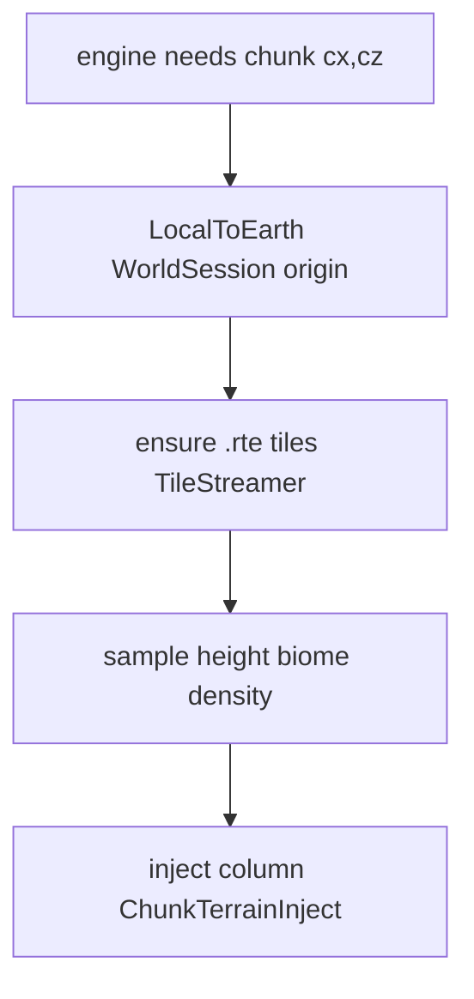

# Absolute Earth data → vanilla chunks

**Owns:** how absolute Earth blocks feed height inject and the tile streamer; sliding host sizes.  
**Not:** mode choice ([SINGLE_WORLD](SINGLE_WORLD.md)), MP policy ([MULTIPLAYER_STREAMING](MULTIPLAYER_STREAMING.md)), lon/lat math ([LON_LAT](LON_LAT.md)), product status ([MODIFICATIONS](MODIFICATIONS.md)).  
**Architecture deep-dive:** [realearth-runtime](realearth-runtime.md). **Hub:** [INDEX](INDEX.md).

## Vanilla already does chunks and combat

Chunks load/unload by view/sim; one shared world space; cross-chunk shooting works. RealEarth does **not** reimplement that. Stock only supplies RWG/DTM heights; RealEarth substitutes absolute DEM when a chunk is needed.

## What RealEarth adds

Only **data behind the chunks**:



```text
engine needs chunk (cx, cz)
  → LocalToEarth (WorldSession origin)
  → ensure .rte tiles (TileStreamer)
  → sample height/biome/density
  → inject into column (ChunkTerrainInject / height query patches)
```

| Step | Code / surface | Notes |
|---|---|---|
| Local ↔ absolute | `WorldSession` | Origin slide changes mapping |
| Tile residency | `TileStreamer` | Hot radius; fail-closed miss |
| Sample | `ChunkTerrainSampler` + height store | Real elev_m, not compress-into-255 |
| Inject | Harmony gen/height hooks | All concrete height APIs; see GAP |

Baked = finite DTM once. Streamed = same chunk rules, height from absolute tiles. When to pick which: [SINGLE_WORLD](SINGLE_WORLD.md).

## Sliding host (`LocalWindowSize`)

Optional bound if the engine dislikes huge absolute X/Z. **Not** a second multiplayer world. Never per-player private hosts.

```text
on height query (worldX, worldZ):
  earth = LocalToEarth(worldX, worldZ)
  ensure tiles around earth
  return seaLevelY + elev_m

on GenerateTerrain(chunk):
  FillChunkHeights + density rewrite
```

Code: `WorldSession`, `TileStreamer`, `ChunkTerrainSampler`, `ChunkTerrainInject`.  
Offline: `realearth sample-chunk --pack … --lon … --lat …`.

## Config (Streamed)

```json
{
  "MapMode": "Streamed",
  "LocalWindowSize": 1024,
  "StreamRadiusTiles": 2,
  "UnloadRadiusTiles": 4,
  "MultiplayerOriginMode": "SoloSlide"
}
```

| Layer | Typical | Cost |
|---|---|---|
| Vanilla view/sim | hundreds of blocks | Mesh + entities |
| Earth tile bubble | `StreamRadiusTiles` × 512 | DEM RAM |
| LocalWindowSize | **1024** default | Coordinate canvas only (not “always mesh 1024²”) |

Prefer **512-1024** host; larger mostly delays slides. `StreamRadiusTiles` shipped **2** (~1 km with 512 tiles).

| Key | Role |
|---|---|
| `LocalWindowSize` | Host canvas before origin slide |
| `StreamRadiusTiles` | Hot `.rte` radius |
| `UnloadRadiusTiles` | Evict cold tiles |
| `MultiplayerOriginMode` | SoloSlide vs SharedFixed (details: [MULTIPLAYER](MULTIPLAYER_STREAMING.md)) |

## State machines (jump list)

Do not re-author full machines here; product runtime owns them:

| Lifecycle | Doc |
|---|---|
| Session SharedFixed / SoloSlide | [realearth-runtime](realearth-runtime.md) §3 |
| Tile Cold / Hot / Miss | [realearth-runtime](realearth-runtime.md) §4 |
| Inject gate Applied / Blocked | [realearth-runtime](realearth-runtime.md) §5 |
| Origin FixedUpdate (client vs dedi) | [realearth-surfaces](realearth-surfaces.md) §3 |
| Claim remap on slide | [realearth-surfaces](realearth-surfaces.md) §4 |

## Expand + inject (both required)

| Alone | Result |
|---|---|
| Expand only | Tall empty columns or stock RWG noise |
| Inject only | Clamp / clip; product rejects compress-as-ship |
| Expand + inject | Product path (still needs light/mesh soak) |

YDim product policy: [HEIGHT_LIMITS](HEIGHT_LIMITS.md). Engine surfaces: [realearth-surfaces](realearth-surfaces.md).

## Status

Canonical status: [MODIFICATIONS](MODIFICATIONS.md) sections B-C. Snapshot for this path:

- Absolute ↔ local, slide, tile bubble: **in C#**.
- Full inject on every new chunk: **needs live retarget** ([GAP](GAP_HARMONY_MODLETS.md), [TODO](../TODO.md)).
- Do not mark live inject Done without dedicated evidence ([realearth-runtime](realearth-runtime.md) §11).

## Related docs

| Doc | Role |
|---|---|
| [LON_LAT](LON_LAT.md) | Dual coords, distortion, wrap |
| [SINGLE_WORLD](SINGLE_WORLD.md) | Baked vs Streamed choice |
| [MULTIPLAYER_STREAMING](MULTIPLAYER_STREAMING.md) | Origin policy for co-op |
| [realearth-runtime](realearth-runtime.md) | Full Streamed lessons |
| [realearth-surfaces](realearth-surfaces.md) | Chunk / Origin / save surfaces |
| [realearth-review](realearth-review.md) | Failure classes (inject gate, tall crust) |
| [MODIFICATIONS](MODIFICATIONS.md) | Product status |
| Generic RE | [`../../7dtd-research/docs/terrain-height.md`](../../7dtd-research/docs/terrain-height.md), [world-chunks](../../7dtd-research/docs/world-chunks.md) |

## Changelog

- **2026-07-18:** Mermaid pipeline, state-machine jump list, expand+inject table, related docs; status defers to MODIFICATIONS.
