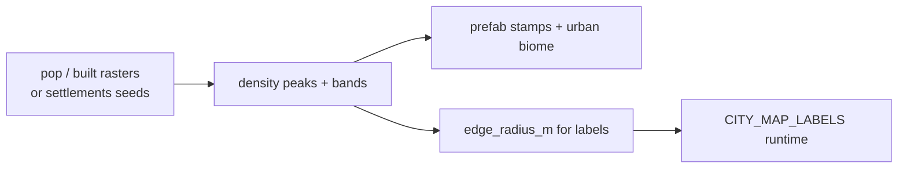

# Cities from population & building density

**Owns:** density → stamp bands and offline pipeline.  
**Not:** map name discovery ([CITY_MAP_LABELS](CITY_MAP_LABELS.md)), legal policy ([REALISM_AND_GOOGLE_EARTH](REALISM_AND_GOOGLE_EARTH.md)), product status ([MODIFICATIONS](MODIFICATIONS.md) section E).  
**Sources:** [DATA_SOURCES](DATA_SOURCES.md). **Ideas:** [DESIGN §18](../DESIGN.md). **Hub:** [INDEX](INDEX.md).

RealEarth places settlements from **open density data**, not Google building footprints. Population 1:1 means **where humans concentrate**, not a cadastral rebuild of every building.

## What drives cities

| Signal | Role |
|---|---|
| **Population density** (people/km²) | How urban an area is; metro vs village |
| **Built-up surface** (optional) | Building fabric even when pop grid is coarse |
| **Named places** (points) | City names, seed peaks (Natural Earth / GeoNames / seed list) |
| **Urban edge** (`edge_radius_m`) | Discover footprint + optional stamp falloff |

Bands (density peak → stamp pack):

| Band | Rough density | Prefab style | Gameplay intent (ideas) |
|---|---|---|---|
| metro | very high | downtown blocks, commercial strips | Highest loot/pressure caps; trader hub candidate |
| large_city | high | downtown fillers, modern houses | Dense POIs, harder nights |
| town | medium | commercial strip, gas station, mixed houses | Default “settled” feel |
| village | low-medium | rural houses, farm, church | Sparse POIs |
| hamlet | low | cabin, cottage, barn | Wilderness transition |
| rural_scatter | sparse | isolated cabins/farms | True wilderness + rare stamps |



## Pipeline

Commands assume `cd tools && uv run …`, or a venv with `realearth` on PATH.

```bash
# 1) Region pack with settlement-driven density (default seeds include real cities)
realearth build-region \
 --west -105.3 --south 39.5 --east -104.7 --north 40.0 \
 --source terrarium \
 --settlements data/examples/settlements_example.geojson \
 --out data/samples/denver_real

# Optional: real rasters (download yourself - GHSL / WorldPop)
realearth build-region ... \
 --population-geotiff /path/to/GHS_POP.tif \
 --built-geotiff /path/to/GHS_BUILT.tif

# 2) Bake one continuous world: density → urban biome + prefabs.xml stamps
realearth bake-world --pack data/samples/denver_real --size 4096 \
 --out worlds/RealEarth --generated

# 3) Install for Proton
./scripts/install_proton.sh
```

Outputs:

- `cities.json` - detected cores (name, band, lon/lat, peak density)
- `population.png` - density channel preview
- `prefabs.xml` - vanilla POIs stamped denser in high-density cells
- biome **wasteland/urban** paint where density is high

## Open data downloads (legal)

| Product | What | Link |
|---|---|---|
| **GHS-POP** | Population grid | [GHSL download](https://human-settlement.emergency.copernicus.eu/download.php) |
| **GHS-BUILT-S** | Built-up surface | same GHSL portal |
| **WorldPop** | Population | worldpop.org |
| **Natural Earth** | City points | naturalearthdata.com |
| **GeoNames** | Place names + pop | geonames.org |
| **OSM** | Building footprints (advanced) | Geofabrik / Overpass |

GHSL is open/free with source acknowledgment. **Do not** use Google Earth 3D buildings.

## In-game map names (discovery)

Named places are **not** painted on the map at world start. The runtime unlocks a label when the player reaches the **edge** of the settlement footprint and pins the name at the **geographic center** (trader-like discovery).

**Edge distance** is measured from real map data: density/built-up blob around each core, or explicit `edge_radius_m` / urban bbox in `settlements.json`. Population-only fallback is last resort.

Full write-up: **[CITY_MAP_LABELS.md](CITY_MAP_LABELS.md)** (`ShowCityNamesOnMap`, `edge_radius_m`, F1 `recities`).

Density stamping (this doc) and map labels (that doc) share bands and place lists but are separate systems: stamps place POIs; labels only name what you have approached.

## Limits in 7DTD

- Prefabs are **vanilla POI stamps**, not real street geometry.
- High density → more stamps closer together; not every real building.
- RWG-style `prefabs.xml` positions are world-centered; y must come from **real surface height** after inject (still **Needed** in Streamed).
- Map discovery edges prefer **map data** (`edge_radius_m` / density blob); population fallback is last resort.
- True Tokyo entity counts will melt the sim: always plan **density caps** (see ENGINE_LIMITATIONS, GAP doc).

## Ideas

Traders at cores, OSM corridors, density→gamestage, content pack split: see **[DESIGN §18](../DESIGN.md)** only (do not fork idea lists). Do not block inject on these.

## Code

- `tools/realearth/density.py` - fields, peaks, stamps, edge measure  
- `tools/realearth/settlements.py` - places, edge_radius_m schema, seeds  
- Wired from `build_region` and `bake_generated_world`  
- `Source/RealEarth/CityMapLabels.cs` - discover-on-approach map NavObjects  

## Related docs

| Doc | Role |
|---|---|
| [CITY_MAP_LABELS](CITY_MAP_LABELS.md) | Discover-on-approach names |
| [DATA_SOURCES](DATA_SOURCES.md) | GHSL / WorldPop / OSM pointers |
| [REALISM_AND_GOOGLE_EARTH](REALISM_AND_GOOGLE_EARTH.md) | Why not Google bulk |
| [LON_LAT](LON_LAT.md) | High-lat edge meters caveat |
| [MODIFICATIONS](MODIFICATIONS.md) | Section E status |
| [ENGINE_LIMITATIONS](ENGINE_LIMITATIONS.md) | Density / sim melt |

## Changelog

- **2026-07-19:** Ownership header; pipeline mermaid; related docs.
