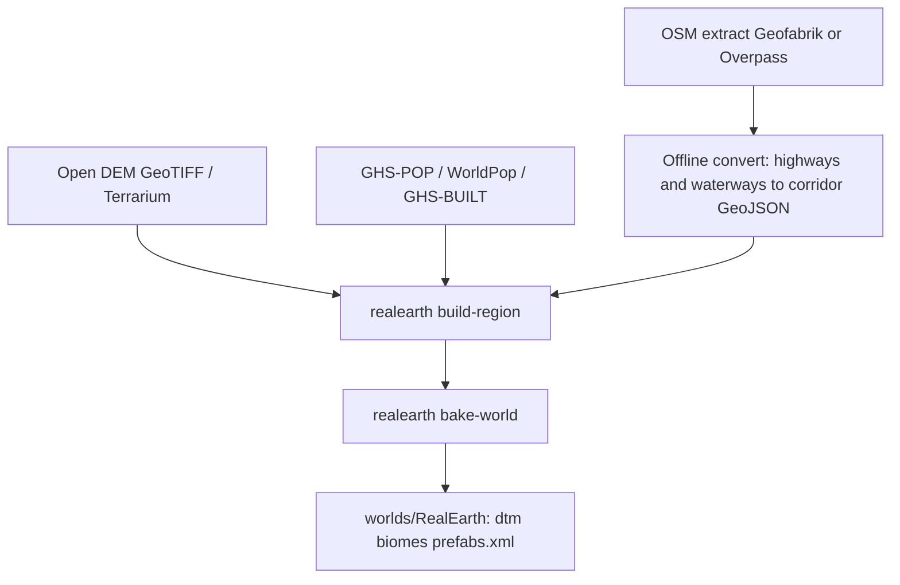

# Real city mapdata → 7DTD (research)

**Owns:** research on converting real streets, buildings, and height into a 7DTD world.
**Not:** legal policy detail ([REALISM_AND_GOOGLE_EARTH](REALISM_AND_GOOGLE_EARTH.md)), density stamp bands ([CITIES_AND_DENSITY](CITIES_AND_DENSITY.md)), download pointers ([DATA_SOURCES](DATA_SOURCES.md)), product status ([MODIFICATIONS](MODIFICATIONS.md)).
**Hub:** [INDEX](INDEX.md). **Date:** 2026-09-01. Research only; no new pipeline code in this note.

---

## Short answer

Google Maps / Earth **cannot** supply bulk streets, 3D buildings, or elevation for RealEarth. The workable path is open DEM + open vector layers (mainly OSM) → region pack → `bake-world` → vanilla prefabs on real surface Y.

Population 1:1 means **where people concentrate**, not a cadastral rebuild of every real building. Streets and waterways can become corridors; buildings become density-banded stamps (and, later, optional footprint-guided placement), not imported meshes.

---

## What “Google-like” layers actually need

| Player-visible layer | Google source (blocked) | Open replacement | RealEarth sink today |
|---|---|---|---|
| Ground height | Earth / Elevation API | Copernicus GLO-30, Terrarium, SRTM/3DEP | `--source geotiff` / `terrarium` → `dtm.raw` |
| Streets | Maps road network | OSM `highway=*` (Geofabrik / Overpass) | `--corridors` GeoJSON LineStrings (`kind=road`) |
| Rivers / water | Maps water | OSM waterways + HydroSHEDS / GSHHG | `--corridors` (`kind=river`) + landcover water |
| Building outlines | Maps / Earth 3D | OSM `building=*` polygons (ODbL) | **Not ingested yet**; density stamps stand in |
| Building height / LOD | Earth photogrammetry | OSM `height` / `building:levels`, or leave unset | Future experiment only |
| Urban intensity | Places / imagery | GHS-POP, WorldPop, GHS-BUILT | `--population-geotiff` / `--built-geotiff` |
| Place names | Places API | Natural Earth, GeoNames, OSM place nodes | settlements / `edge_radius_m` discovery |

Policy: [REALISM_AND_GOOGLE_EARTH.md](REALISM_AND_GOOGLE_EARTH.md). Downloads: [DATA_SOURCES.md](DATA_SOURCES.md).

---

## Conversion pipeline (legal stack → 7DTD)



### Step A: Height (already shipped)

1. Pick a bbox (city or metro). At 1 m/block a baked edge is at most ~16 km ([ENGINE_LIMITATIONS](ENGINE_LIMITATIONS.md)).
2. Ingest DEM: Copernicus ~30 m is the usual city DEM; finer local lidar only where license allows.
3. Product path keeps **meters ASL** and YDim expand; do not bake global height compress as the ship path ([HEIGHT_LIMITS](HEIGHT_LIMITS.md)).

```bash
cd tools && uv run --locked realearth build-region \
  --west ... --south ... --east ... --north ... \
  --source geotiff --geotiff /path/to/copernicus.tif \
  --resolution 30 \
  --out data/samples/city_pack
```

### Step B: Density → “city feel” (already shipped)

Population / built-up rasters drive stamp bands and urban biome paint. That is the current city path: metro downtown packs vs village cabins, not OSM building meshes ([CITIES_AND_DENSITY](CITIES_AND_DENSITY.md)).

```bash
realearth build-region ... \
  --population-geotiff /path/to/GHS_POP.tif \
  --built-geotiff /path/to/GHS_BUILT.tif \
  --settlements data/examples/settlements_example.geojson
```

`bake-world --generated` then writes `prefabs.xml` stamps at real surface Y (`density.py::stamp_prefabs_from_density`).

### Step C: Real streets / rivers as corridors (hook exists; OSM extract is offline)

`tools/realearth/corridors.py` already stamps LineString GeoJSON into landcover + population:

- `kind=road|rail`: paints corridor, zeros population under carriageway
- `kind=river`: wider water corridor; road wins at crossings (bridge semantics)
- Road never paints over ocean

CLI: `--corridors path/to/corridors.geojson` on `build-region` (`cli.py`, applied in `region.py`).

**Missing offline piece (research target):** OSM → that GeoJSON. Sketch:

1. Download Geofabrik `.osm.pbf` for the country/region, or Overpass for a small bbox.
2. Filter: `highway` in `{motorway,trunk,primary,secondary,tertiary,residential,…}`, `waterway` in `{river,canal,stream}`, optional `railway`.
3. Reproject / clip to the same lon/lat bbox as the region pack (equirect assumptions: [LON_LAT](LON_LAT.md)).
4. Emit RFC 7946 FeatureCollection of LineStrings with `properties.kind`.
5. Optionally simplify (Douglas-Peucker) so dense downtown grids do not explode segment count.
6. Attribute width later: map `highway=motorway` → larger half-width than `residential` (today half-widths are fixed constants in `corridors.py`).

Gap status: roads/rivers first-class is **Later** (DESIGN P5, GAP item 26-27, offline pipeline table in [GAP_HARMONY_MODLETS](GAP_HARMONY_MODLETS.md)).

### Step D: Real building footprints (not built; options)

OSM building polygons are legal under ODbL with share-alike on derived databases ([ATTRIBUTION.md](../ATTRIBUTION.md)). Ways to use them without pretending Google 3D:

| Approach | How | Pros | Cons |
|---|---|---|---|
| **A. Density-only (current)** | Ignore footprints; stamp by pop/built | Simple, shipped | Streets may miss buildings; layout not cadastral |
| **B. Footprint as stamp mask** | Rasterize OSM buildings; only place prefabs where footprint cells are set | Aligns blocks to real parcels roughly | Prefab size ≠ real footprint; lots of conflict/dedupe work |
| **C. Extrude voxels** | Fill polygon, height from `building:levels` × ~3 m | Looks “real” from air | Ugly boxes, sleeper/POI systems broken, RAM/CPU at metro scale |
| **D. Kit matching** | Classify footprint area/aspect → choose downtown vs house prefab | Keeps 7DTD gameplay POIs | Hard matching; still not true architecture |
| **E. Hybrid** | Corridors from OSM + density stamps + optional footprint mask in metro cores only | Matches DESIGN “density over cadastral truth” | Needs budgets so Tokyo does not melt sim |

Recommended research direction: **E**, with A as the default ship path. Do not pursue C as product; it fights sleeper decoration, quests, and performance (GAP items 16, 21).

### Step E: Bake and install

```bash
realearth bake-world --pack data/samples/city_pack --size 4096 \
  --out worlds/RealEarth --generated
# then install / expand per MODLET / make install-full
```

Outputs that matter for “real city” QA: `dtm` / height export, `biomes.png`, `population.png`, `cities.json`, `prefabs.xml`, optional corridor-burned landcover.

---

## Scale and fidelity constraints

| Constraint | Effect on city conversion |
|---|---|
| ~16k world edge at 1 m/block | One baked map ≈ one metro slice, not a whole country |
| DEM often ~30 m | Streets at 1 m need OSM vectors; DEM alone cannot draw lanes |
| Prefabs ≠ architecture | Recognizable *layout* (highways, density peaks), not photogrammetry |
| ODbL share-alike | Derived road/building databases need attribution and share-alike discipline |
| Metro prefab budgets | Stamp spacing + caps required or sim dies ([ENGINE_LIMITATIONS](ENGINE_LIMITATIONS.md), GAP 21) |
| No Google bulk | Scraping Maps/Earth tiles or Elevation API dumps is out of scope |

---

## Concrete city experiment (proposed, not run here)

Pick one mid-size city bbox (~8-12 km edge), e.g. a dense downtown plus suburbs:

1. Copernicus GLO-30 GeoTIFF for the bbox.
2. GHS-POP + GHS-BUILT clipped to bbox.
3. Geofabrik extract → filter highways/waterways → corridor GeoJSON for `--corridors`.
4. `build-region` + `bake-world --generated` at 4096 or 8192.
5. Viewer QA: roads visible in landcover, density peaks match known districts, stamps sit on DEM.
6. Optional second pass: OSM building raster as a **mask only** in the metro band; measure stamp count vs unmasked.

Success criteria for research (not ship gates): highway corridors readable from the map; city discovery labels match named places; no Google data in the pack manifest.

---

## What already exists vs what this note proposes

| Piece | State |
|---|---|
| Open DEM ingest | Done (`terrarium`, `geotiff`, …) |
| Population / built → stamp bands | Done (`density.py`, CITIES_AND_DENSITY) |
| Corridor GeoJSON stamp rules | Done (`corridors.py`, `--corridors`) |
| OSM PBF/Overpass → corridor GeoJSON | **Missing offline tool** (document as next pipeline work) |
| OSM building footprints → stamps | **Not built**; approaches A-E above |
| Google Maps/Earth bulk | **Forbidden** |

---

## Related docs

- [REALISM_AND_GOOGLE_EARTH.md](REALISM_AND_GOOGLE_EARTH.md): why not Google
- [DATA_SOURCES.md](DATA_SOURCES.md): what to download
- [CITIES_AND_DENSITY.md](CITIES_AND_DENSITY.md): density → stamps
- [CITY_MAP_LABELS.md](CITY_MAP_LABELS.md): discovery names
- [DESIGN.md](../DESIGN.md) §6.3 / §7 / P5: roads and population stack
- [GAP_HARMONY_MODLETS.md](GAP_HARMONY_MODLETS.md) items 26-27 + offline OSM rows
- [ENGINE_LIMITATIONS.md](ENGINE_LIMITATIONS.md): world size and sim ceilings
