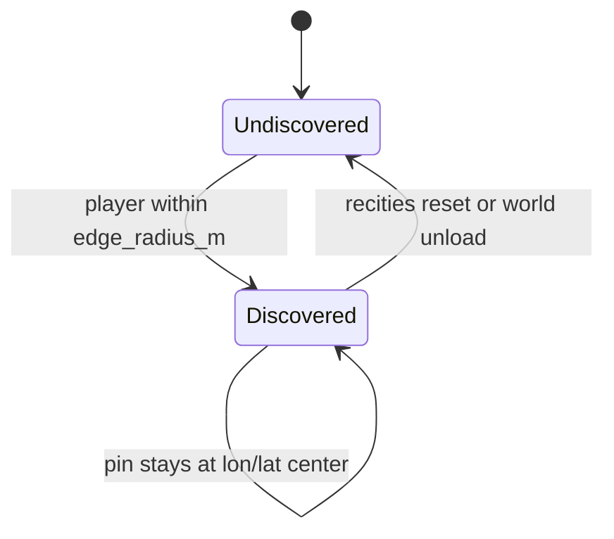

# City names on the in-game map

RealEarth shows **real place names** on the 7DTD map only after you **discover** them by approaching the city. Discovery is **edge-based**: reaching the outskirts is enough. The label is always pinned at the **geographic center** of the place (as on a real map), not under the player.

Behavior is intentionally close to **traders**: nothing until you get close; once found, the marker stays.

**Owns:** discover-on-approach map names. Density stamps: [CITIES](CITIES_AND_DENSITY.md). Config keys: [MODLET](MODLET.md). Lon/lat: [LON_LAT](LON_LAT.md). Hub: [INDEX](INDEX.md).

---

## Product rules

| Rule | Detail |
|---|---|
| **No pre-fill** | World load does **not** dump all city names onto the map. |
| **Discover at edge** | Unlock when player distance to city center ≤ **edge radius**. |
| **Pin at center** | NavObject position is always lon/lat center → local block, never player position. |
| **Sticky** | Once discovered in the session, the name stays until `recities reset` or world unload. |
| **Origin slide** | Discovery set is kept; markers are re-registered at new local coords after a window slide. |



---

## Player-facing flow

1. Enter world with `ShowCityNamesOnMap=true` (default).
2. Catalog loads from pack data + in-bbox seed cities (see [Data sources](#data-sources)).
3. While you move, the runtime checks distance to undiscovered places (throttled ~every 15 player ticks).
4. When you hit a place’s edge:
   - Log: `CityMapLabels: discovered 'Denver' (dist=… edge=… center=(x,z)).`
   - Map gains a `realearth_city` NavObject at the **center**, with `name` = place name.
5. Open the in-game map: the name appears at the correct geographic position.

You do **not** need to walk to downtown. Crossing the estimated urban footprint boundary is enough.

---

## Edge radii (from real map data)

Discovery edge is the **urban footprint half-width in meters**, not a fixed band table.

Effective in-game radius (blocks ≈ m at 1:1):

```text
edge = max(32, EdgeRadiusBlocks * CityMapDiscoverRadiusScale)
```

### Priority (highest first)

| Source | How | `edge_source` |
|---|---|---|
| **Density / built-up raster** | Flood-fill density peak above contour (~12% of peak); max distance peak → blob edge in meters | `density` |
| **Explicit extent fields** | `edge_radius_m`, `radius_m`, `edge_radius_km`, or `west/south/east/north` / `bbox` urban envelope | `map` |
| **Urban polygons** (GeoJSON) | Centroid + envelope half-extent from Polygon/MultiPolygon | `map` |
| **Seed extents** | Hardcoded half-widths for demo majors (NYC, Denver, …) when in pack bbox | `seed` |
| **Population fallback only** | `radius_km = clamp(sqrt(pop)/40, 1.5, 80)` (same as paint Gaussian when no map extent) | `population_fallback` |

Pipeline (`build_region` / `detect_city_cores`) **measures** each core against the population/built-up field and writes `edge_radius_m` + `edge_source` into `settlements.json` and `cities.json` cores.

Runtime (`CityMapLabels`) **reads** those fields; it does not invent band radii (metro=14 km, …) anymore.

Raise `CityMapDiscoverRadiusScale` only if discovery still feels tight after map extents are correct.

---

## Config (`Config/realearth.json`)

| Key | Default | Meaning |
|---|---|---|
| `ShowCityNamesOnMap` | `true` | Master switch for discover-on-approach labels |
| `CityMapMaxLabels` | `250` | Cap on **discovered** pins (catalog is sorted largest population first) |
| `CityMapMinPopulation` | `0` | Skip places below this population when discovering |
| `CityMapDiscoverRadiusScale` | `1.0` | Multiplier on all edge radii (min effective scale treated as 1.0 if ≤ 0.05) |

Templates: `Config/realearth.json`, `realearth.advanced_height.json`, `realearth.mp.json`.  
Packaging sets `ShowCityNamesOnMap` default true via `scripts/package_mod.sh`.

**Off for production-like maps:** `"ShowCityNamesOnMap": false`.

---

## Data sources

Catalog is built once per world (until reset), population-sorted descending.

### Load paths (first non-empty wins)

1. `{TilePackPath}/settlements.json`
2. `{TilePackPath}/cities.json`
3. `{ModPath}/Data/settlements.json`
4. `{ModPath}/Config/settlements.json`

Then **seed places** in the pack bbox (if `HasRegionalBbox`) are merged. Duplicates by name (case-insensitive) are dropped.

### JSON shape

Array of objects, or `cities.json` object with a `cores` array. Minimal parser: place rows are objects that have `"name"` and `"lon"`.

```json
[
  {
    "name": "Denver",
    "lon": -104.9903,
    "lat": 39.7392,
    "population": 715000,
    "band": "large_city",
    "edge_radius_m": 18420.5,
    "edge_source": "density"
  }
]
```

| Field | Required | Notes |
|---|---|---|
| `name` | yes | Display string on map (`NavObject.name`) |
| `lon`, `lat` | for placement | WGS84; converted via `WorldSession.LonLatToLocal` |
| `population` | recommended | Sort order + min-pop filter + fallback edge only |
| `band` | optional | Stamp / density band (not used for edge distance) |
| `edge_radius_m` | **preferred** | Urban edge half-width in meters (map data) |
| `edge_source` | optional | `density` / `map` / `seed` / `population_fallback` |
| `radius_m` / `radius_km` / `edge_radius_km` | optional | Aliases for edge |
| `west`,`south`,`east`,`north` or `bbox` | optional | Real urban-area envelope → half-extent meters |

Pipeline output writes measured edges into `cities.json` cores and `settlements.json`; see [`CITIES_AND_DENSITY.md`](CITIES_AND_DENSITY.md).

### Seed list (in-mod)

Hardcoded major places (NYC, LA, Chicago, Denver, London, Paris, Berlin, Tokyo, Sydney, São Paulo, Cairo, Mumbai, Kathmandu, Namche Bazaar, Lukla, Dingboche, Base Camp, …) are added when they fall inside the pack bbox. Populations/bands are approximate test seeds, not census-grade.

---

## Map presentation (XML)

`Config/nav_objects.xml` appends class **`realearth_city`**:

- Map: yellow-ish icon, `text_type=Name`, `font_size=28`, no distance cull on map (`max_distance=-1`).
- Compass / on-screen: name text with finite distance caps.

If register with `realearth_city` fails (class not loaded), code falls back to `quick_waypoint`.

NavObject fields set at runtime: `name`, `usingLocalizationId=false`, `hiddenOnMap=false`, `IsActive=true` (via reflection).

---

## Runtime architecture

| Piece | Role |
|---|---|
| `CityMapLabels` | Catalog, discovery set, NavObject pin/unpin |
| `RuntimeHooks.HooksImpl.PlayerTickPostfix` | Calls `TickPlayer` every player tick (with FOW) |
| `RuntimeHooks` world ready | `CityMapLabels.Reset()` so a new world starts undiscovered |
| Origin slide path | `RefreshAfterOriginSlide()` then `TickPlayer` |
| `WorldSession.LonLatToLocal` | Center block position for distance + pin |
| `NavObjectManager.RegisterNavObject` | Engine map markers (reflection) |

### Discovery algorithm (simplified)

```text
throttle ~15 ticks
ensure catalog + NavObjectManager + Session
for each already discovered name:
  if nav handle missing → re-pin at center (after slide)
if discovered.Count >= CityMapMaxLabels: stop
for each catalog place (pop order):
  if already discovered or pop < min: skip
  dist = distance(playerLocal, LonLatToLocal(center))
  if dist <= edge: RegisterNavObject at center, add to discovered
```

Markers are **not** recreated every tick (avoids map flicker). Handles are only created when missing.

### Session / coordinates

Requires `ModApi.Session` (WorldSession). Local X/Z are the same host Cartesian window as the rest of Streamed RealEarth. After an **origin slide**, local numbers for the same lon/lat change; discovery names stay, positions are recomputed.

Height of the pin: engine height sample at center, or sea-level fallback.  
Distance uses local blocks vs `edge_radius_m` (high-lat / bbox caveats: [LON_LAT](LON_LAT.md)).

---

## F1 console (`recities`)

Commands: `recities`, `re_cities`, `re_mapcities`.

| Command | Effect |
|---|---|
| `recities` | Status: catalog size, discovered count, config flags |
| `recities reset` | Clear discoveries and remove all RealEarth city NavObjects |
| `recities here` | Debug: one discovery pass with temporary `CityMapDiscoverRadiusScale=50`, then restore scale |

Help text: names unlock at the city edge; pin is always at the center.

Log channel: standard RealEarth mod log (`CityMapLabels: …`).

---

## Comparison to traders

| | Vanilla traders | RealEarth city names |
|---|---|---|
| When marked | Near trader / discovery rules | Player enters city **edge** radius |
| Marker location | Trader entity / POI | **Geographic center** of named place |
| Persistence | Session / save rules (game) | Session sticky until reset / world ready |
| Source | Prefabs / quests | `settlements.json` + seeds |

City labels do **not** spawn traders or POIs; they only name places already represented (or planned) by density/stamps.

---

## Limits and non-goals

- **Not** a full atlas: only discovered places, capped by `CityMapMaxLabels`.
- **Not** save-persistent discovery (yet): new session / world ready clears state.
- **Not** multiplayer-synced discovery list: each client that runs the tick discovers independently (same rules).
- Edge radii are **heuristic footprints**, not OSM city boundaries.
- Browser **viewer** shows all settlements for QA; that is separate from in-game discovery.
- Globe UI “discovered cities” in DESIGN is the broader UX goal; **in-game map NavObjects** are the implemented path today.

---

## Code map

| Path | Content |
|---|---|
| `Source/RealEarth/CityMapLabels.cs` | Catalog, map-edge discovery, pins |
| `tools/realearth/density.py` | `measure_urban_edge_radius_m`, cores with `edge_radius_m` |
| `tools/realearth/settlements.py` | Schema, bbox/polygon edge, seeds |
| `Source/RealEarth/ConsoleCmdReCities.cs` | F1 `recities` |
| `Source/RealEarth/RuntimeHooks.cs` | Tick + world ready + origin slide |
| `Source/RealEarth/RealEarthConfig.cs` | Config keys + defaults |
| `Config/nav_objects.xml` | `realearth_city` class |
| `Config/realearth*.json` | Feature flags |

---

## Quick test checklist

1. `make build` (or install) with game closed; copy DLL + `Config/nav_objects.xml` + pack with `settlements.json` or rely on seeds.
2. Spawn near a known seed (e.g. Denver pack bbox). Confirm log has `catalog N places (discover-on-approach)` and **no** instant dump of all names.
3. Approach city edge; expect `discovered '…'` and map label at center.
4. `recities` → discovered count increments; `recities reset` clears map pins.
5. `recities here` force-unlocks nearby for debugging without traveling full edge distance (large temp scale).
6. If origin slide fires during long travel, labels for already-discovered cities reappear at the same Earth position.

## Related docs

| Doc | Role |
|---|---|
| [CITIES_AND_DENSITY](CITIES_AND_DENSITY.md) | Density stamps sharing place data |
| [LON_LAT](LON_LAT.md) | LonLatToLocal after slide |
| [MODLET](MODLET.md) | Config keys |
| [MODIFICATIONS](MODIFICATIONS.md) | Section E status |

## Changelog

- **2026-07-19:** Ownership header; related docs.
