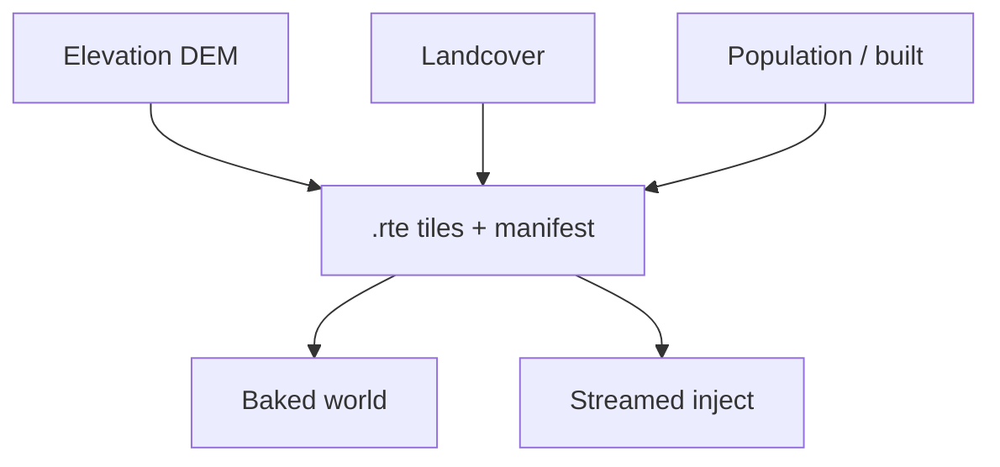

# Production data sources

**Owns:** which open products to download and how to point the CLI at them.  
**Not:** legal policy narrative ([REALISM_AND_GOOGLE_EARTH](REALISM_AND_GOOGLE_EARTH.md)), density stamp bands ([CITIES_AND_DENSITY](CITIES_AND_DENSITY.md)), product status.  
**Hub:** [INDEX](INDEX.md).

CLI examples assume `cd tools && uv run realearth …` (or `make` targets from repo root).

---

## Elevation (recommended order)

| Priority | Product | Typical res | How |
|---|---|---|---|
| 1 | **Copernicus DEM GLO-30** | ~30 m | OpenTopography / ESA GeoTIFF → `--source geotiff` |
| 2 | **AWS Terrain Tiles (Terrarium)** | zoom-dependent | `--source terrarium` (open, not Google) |
| 3 | **SRTM** / USGS 3DEP | ~30 m where available | GeoTIFF |
| 4 | **Open-Meteo** elevation API | point/grid | `--source open_meteo` (**small demos only**, rate limits) |
| debug | synthetic | n/a | `demo` / height-test maps |

```bash
# Real open DEM tiles (network)
realearth build-region \
  --west -105.3 --south 39.5 --east -104.7 --north 40.0 \
  --source terrarium --terrarium-zoom 11 --resolution 30 \
  --out data/samples/denver_real

# Your downloaded Copernicus/SRTM GeoTIFF
realearth build-region ... --source geotiff --geotiff /path/to/copernicus.tif
```

With GIS extras:

```bash
cd tools && uv sync --extra gis --extra dev
```

**Product height:** tiles store **meters ASL**. Runtime: `gameY ≈ seaLevelGameY + elev_m` after YDim expand. Do not bake global compress as the ship path ([HEIGHT_LIMITS.md](HEIGHT_LIMITS.md)).

---

## Land cover

| Product | Notes |
|---|---|
| **ESA WorldCover 10 m** | CC BY 4.0; best urban/forest/water paint |
| Dynamic World / MODIS | Fallback when WorldCover missing |
| Heuristic elev+lat | Always available offline; lower fidelity |

Map into vanilla biome RGB for Baked `biomes.png`, or runtime landcover channel for Streamed.

---

## Population / cities

| Product | Use |
|---|---|
| **GHS-POP** | People/km² grids → density channel |
| **GHS-BUILT-S** | Built-up surface boosts suburbs |
| **WorldPop** | Alternate population |
| **Natural Earth** | Named place points |
| **GeoNames** | Place names + population |
| Seed list | Built-in majors for demos (see settlements.py) |

Pipeline writes `settlements.json` / `cities.json` with optional **`edge_radius_m`** from density blobs or polygons ([CITY_MAP_LABELS.md](CITY_MAP_LABELS.md), [CITIES_AND_DENSITY.md](CITIES_AND_DENSITY.md)).

```bash
realearth build-region ... \
  --population-geotiff /path/to/GHS_POP.tif \
  --built-geotiff /path/to/GHS_BUILT.tif \
  --settlements data/examples/settlements_example.geojson
```

---

## Roads / water

| Product | Use |
|---|---|
| **OpenStreetMap** (ODbL) | Highways, rivers (Geofabrik extracts) |
| Hydro DEMs / water masks | Coast and lake paint |

**Ideas:** corridor stamps along motorways; river density boost; never require OSM for core height path.

---

## Resolution and scale guidance

| Goal | Suggested sample scale | Notes |
|---|---|---|
| Everest height proof | small bbox, 1-5 m if possible | Vertical 1:1 matters more than width |
| Regional play (city metro) | 10-30 m | Balance detail vs pack size |
| Continental experiment | 100 m+ or progressive LOD | Honest about stretch |
| Full planet 1 m | TB-class | CDN + progressive; not one zip |

Regional packs may use `resolution_m` ≫ 1. That is still valid for demos; do not claim “true 1 m horizontal” unless the pack is built that way ([LON_LAT.md](LON_LAT.md)).

---

## Pack quality scorecard (idea → practice)

Every distributable pack should be able to answer:

| Check | Why |
|---|---|
| Bounding box + CRS assumptions | Lon/lat clamp / stretch |
| Horizontal sample size (m) | Honesty of 1:1 claim |
| Elevation source + version/date | Reproducibility |
| Population/built sources or “seeds only” | City fidelity |
| License / ATTRIBUTION entries | Legal |
| File hashes (manifest) | Integrity |
| `edge_radius_m` coverage | Map discovery quality |
| Sea level game Y used | Height mapping |

Implement as `earth.manifest.json` fields over time (Needed: reproducible manifests in TODO).

---

## Licensing

Ship `ATTRIBUTION.md` with every pack. See REALISM_AND_GOOGLE_EARTH.md for why Google is off-limits.

| Class | Typical constraint |
|---|---|
| Copernicus / many DEMs | Attribution; check commercial terms |
| WorldCover | CC BY |
| OSM | ODbL share-alike on **databases** derived from OSM |
| GHSL / WorldPop | Product-specific; read before redistribute |

**Do not** commit multi-GB third-party rasters to git. Point builders at user-held downloads.



## Related docs

| Doc | Role |
|---|---|
| [REALISM_AND_GOOGLE_EARTH](REALISM_AND_GOOGLE_EARTH.md) | Allowed vs forbidden sources |
| [CITIES_AND_DENSITY](CITIES_AND_DENSITY.md) | Density → stamps |
| [HEIGHT_LIMITS](HEIGHT_LIMITS.md) | Real meters in tiles |
| [ATTRIBUTION](../ATTRIBUTION.md) | Licenses |
| [MODIFICATIONS](MODIFICATIONS.md) | Pipeline status (section D) |

## Changelog

- **2026-07-19:** Ownership; pack pipeline mermaid; related docs.
