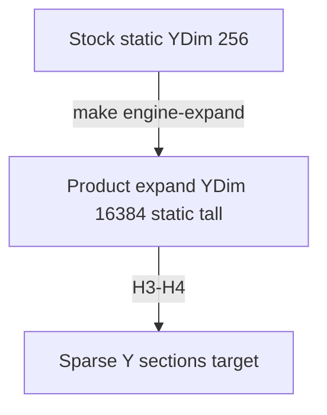

# Dynamic chunk height (not a static 0-255 slab)

**Owns:** future sparse Y design. Product height policy: [HEIGHT_LIMITS](HEIGHT_LIMITS.md). Hub: [INDEX](INDEX.md).

## Stock 7DTD: static column height

Each world column is a **fixed** vertical slab:

```
Y = 0 ………………… Y = 255 (always allocated / assumed)
 [bedrock … dirt … air … sky]
```

- Ocean floor and Everest summit share one **static** stock Y budget (~255) unless the engine is expanded.
- RAM and meshing assume a constant column size on stock.
- RealEarth product path is **real meters + YDim expand**, not global compress into 255.

You already accept **dynamic horizontal** loading (window slides with absolute X/Z). 
Vertical should follow the same idea: **only allocate height where the terrain needs it**.

## What “dynamic height” means

Not one global 0-9000 stack for every column on Earth. That would explode memory.

Instead (Minecraft 1.18-style / sparse columns):

```
Absolute Y is free in theory (or a large range, e.g. -512 … +8192)

Per (chunkX, chunkZ) column:
 only store SECTIONS that actually contain solid/interesting blocks

 section index s covers Y in [s*SECTION_H, (s+1)*SECTION_H)
 empty air sections are missing (or a single “all air” flag)
```

| Concept | Static (vanilla) | Dynamic (target) |
|---|---|---|
| Column height | Fixed 256 | Variable: only used Y band + air margin |
| Ocean column | Still 256 tall | Thin: seabed ± a few dozen + water |
| Mountain column | Same 256, peaks crushed | Many sections up to real (or high) elevation |
| Memory | O(width × depth × 256) | O(width × depth × **occupied** height) |
| Streaming | Load columns by XZ | Load columns by XZ **and** Y sections near camera |

So: **horizontal** bubble around the player **and** **vertical** sections around camera/terrain surface.

## How this pairs with RealEarth absolute streaming

```
Absolute Earth (X, Z) huge → sliding host window (already designed)
Absolute elevation meters → absolute or expanded Y (this doc)

Player at (earthX, earthZ, surfaceY):
 stream XZ tiles of DEM
 stream Y sections: [surfaceY - dig_margin, surfaceY + build_margin]
 unload distant XZ columns and far-above/below Y sections
```

Surface Y comes from DEM (real meters), not from a 0-255 remap, **if** the engine stores tall columns.

## Design sketch for a 7DTD height mod

### 1. Sectioned columns

- `SECTION_HEIGHT = 16` or `32` (match mesh-friendly sizes).
- Column = `Dictionary<sectionIndex, Section>` or sparse array with min/max section.
- Section = block IDs / density / lights for that Y band only.

### 2. World Y range

Pick a finite absolute range first (doable):

| Range | Approx real span at 1 m/block | Use |
|---|---|---|
| 0-255 | 255 m | Vanilla |
| −64-512 | ~576 m | Modest expansion |
| −128-2048 | ~2.1 km | Serious alpine |
| −256-8192 | ~8.4 km | Near-Everest with headroom |

Even with dynamic sections, a **global max Y** is wise so arrays and net packets stay bounded. Dynamic means **sparse within that range**, not infinite Y forever.

### 3. What must be patched (7DTD / Unity)

Same list as HEIGHT_LIMITS, but re-architected around sections:

- Chunk allocation / free 
- GetBlock / SetBlock Y checks 
- Terrain gen fill loops 
- Mesh builder vertical loops (only iterate existing sections) 
- Lighting (section-local + neighbor sections) 
- Save format (`.7rg` or sidecar for tall sections) 
- Prefab paste (Y offset into section space) 
- Sync: send only dirty sections 

Harmony-only is possible for *some* bounds checks; **storage layout** almost certainly needs a parallel chunk type or rewritten density buffers.

### 4. RealEarth integration

| Data | Static height (now) | Dynamic height (future) |
|---|---|---|
| `.rte` elevation | real meters | unchanged |
| height map (`one_to_one`) | product: sea+elev_m | same (maxY = expanded ceiling) |
| `dtm.raw` bake | gameY×256 in 0-255 | bake expanded DTM or skip DTM, inject from `.rte` only |
| Streamed inject | write into fixed column | create sections up to surface + margin |

Keep **meters in `.rte`** either way.

### 5. Phased implementation

| Phase | Deliverable | Status |
|---|---|---|
| **H0** | Product: real meters + YDim expand (not global compress) | **Product path** ([HEIGHT_LIMITS](HEIGHT_LIMITS.md)) |
| **H1** | Research: Chunk arrays, Y clamps, light/mesh 255 sites on 3.0.1 | **Closed** in research + [realearth-surfaces](realearth-surfaces.md) |
| **H2** | Static expand at full product YDim (16384) soak | **Partial** (patcher ships; live soak open) |
| **H3** | Sparse sections: only allocate used Y bands | **Later** (this doc) |
| **H4** | Stream sections with player Y (dig deep / fly high) | **Later** |
| **H5** | Multiplayer section sync | **Later** |

**H2** is the near-term engine work (expand + inject). **H3-H4** is the real dynamic RAM design.


## Why static raised height alone is not enough

If you only change 256 → 4096 **without** sparsity:

- Every flat grassland column still pays for 4096 slots of air.
- Full-Earth horizontal stream × tall static columns = memory death.

Dynamic height = **sparsity in Y**, same philosophy as **sparsity in XZ**.

## Practical RealEarth recommendation

1. **Near term (product):** real height + YDim expand 16384 + inject; absolute XZ streaming.
2. **Do not** treat global compress into 255 as a shipping milestone.
3. **Target architecture:** **sectioned dynamic columns** + XZ sliding window + Y section stream.
4. Never bake Google/3D heights into static 255 and call it alpine 1:1.


## Relation to multiplayer

- Shared absolute (X, Y, Z). 
- Each client streams nearby XZ columns **and** Y sections near that client’s camera. 
- Shooting uses absolute coords; unloaded sections on a client still resolve on the server if the target is loaded there.

## Bottom line

| Idea | Verdict |
|---|---|
| Static 0-255 forever | Forces global vertical compression |
| Static 0-N (N large) | Works a bit better; RAM heavy |
| **Dynamic section height** | Correct long-term match to “stream the world” |
| RealEarth data | Keep real meters always; inject 1:1 after expand |

Yes: **chunk height should be dynamic (sparse sections), not a static 255 slab**, if RealEarth is serious about absolute vertical scale. That is engine mod territory, parallel to absolute XZ streaming. Product status for expand/inject stays in [MODIFICATIONS](MODIFICATIONS.md); this file owns the sparse-Y design only.



## Related docs

| Doc | Role |
|---|---|
| [HEIGHT_LIMITS](HEIGHT_LIMITS.md) | Product vertical policy (expand required) |
| [ENGINE_LIMITATIONS](ENGINE_LIMITATIONS.md) | Stock vertical blockers |
| [realearth-surfaces](realearth-surfaces.md) | GetBlock index, light 255, save-64 |
| [MODIFICATIONS](MODIFICATIONS.md) | Expand/inject status |
| [research terrain-height](../../7dtd-research/docs/terrain-height.md) | Stock vs expand constants |

## Changelog

- **2026-07-19:** Phase table aligned to expand-required product path; mermaid; related docs.
