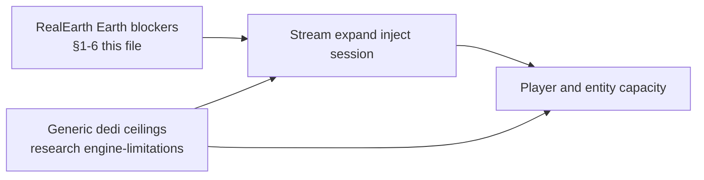

# Engine limitations RealEarth must overcome

**Owns:** stock engine blockers for **1:1 Earth** (severity + RealEarth attack path).  
**Not:** generic dedicated ceilings that apply to any server ([research engine-limitations](../../7dtd-research/docs/engine-limitations.md)), product surface status ([MODIFICATIONS](MODIFICATIONS.md)), vertical product policy ([HEIGHT_LIMITS](HEIGHT_LIMITS.md)), Streamed lessons ([realearth-runtime](realearth-runtime.md)).  
**Game:** 7 Days to Die V3.1.0 (Unity Mono, stock dedicated/client).  
**Product goal:** 1:1 real Earth geography + population density (see [`../DESIGN.md`](../DESIGN.md)). **Hub:** [INDEX](INDEX.md).

This is a **limitation map**, not a build plan. Each row: what the stock engine assumes, why it blocks 1:1 Earth, how hard it is, and how RealEarth attacks it.

**Also read:** generic dedicated limits (single-thread sim, player O(N²) net, AI volume, Boehm GC, save/YDim, EAC) live in  
[`../../7dtd-research/docs/engine-limitations.md`](../../7dtd-research/docs/engine-limitations.md).  
Those still bind RealEarth (metro density, tall inject, MP soak) but are not Earth-specific.

**Severity**

| Tag | Meaning |
|---|---|
| **Blocker** | Product 1:1 fails until solved |
| **Hard** | Solvable, large engineering / ongoing retarget cost |
| **Soft** | Workable with design limits or content policy |
| **Ops** | Host/install/process constraint, not gameplay code |

---

## 1. Vertical world (height)

| Limit (stock) | Evidence | Why it matters | Severity | Overcome with |
|---|---|---|---|---|
| Column height fixed **YDim = 256** (`ChunkBlockYDim`) | `WorldConstants` literals; `engine-audit` | Everest ≈ 8.8 km at 1 m/block cannot fit | **Blocker** | YDim expand IL patch (`make engine-expand`, default **16384**) |
| `cMaxHeight` / surface byte paths **255** | DTM / heightmap APIs | Byte terrain maps cannot store tall peaks | **Blocker** | Bypass byte DTM for Streamed: inject int heights; expand vertical loops |
| Literals **inlined in IL** (`ldc`) | Probe: `SetValue` cannot raise ceiling | Runtime field rewrite is insufficient | **Blocker** | Selective Mono.Cecil rewrites; re-apply after every Steam update |
| **256 means two things**: vertical dim **and** 16×16 XZ map area | Patcher notes | Blind 256→16384 corrupts heightmaps and slows load ~64× | **Hard** | Vertical-only site list; never expand XZ map fields |
| Layer storage **64 layers × 4** must stay consistent | Alloc/free of layer arrays | Mismatched layer count → Unity.Collections Free crashes | **Hard** | Rewrite alloc + free layer counts together |
| Static full-column RAM O(YDim) per column | Engine design | Tall static columns everywhere = huge RAM | **Hard** | Near term: accept expand cost near players only; long term: **sparse Y sections** ([`DYNAMIC_CHUNK_HEIGHT.md`](DYNAMIC_CHUNK_HEIGHT.md)) |
| Mesh / light / stability / density loops assume short Y | Method list in patcher (`GetBlock`, `SetDensity`, sunlight, …) | Tall columns crash or clip if loops still use 255/256 | **Hard** | Expand Y-bound methods; validate H500 → Everest soak |
| Fall damage / kill planes / spawn Y | Spawn and physics | Extreme falls, bad spawn on peaks, water at wrong band | **Soft→Hard** | Re-tune after expand; spawn on real surface |
| Prefabs authored for ~255 roofs | POI library | Tall mountains + short prefabs look wrong; paste Y may clip | **Soft** | Stamp relative to surface; optional tall-aware packs later |
| Saves (`.7rg`) may assume stock packing | Region format | Tall worlds may bloat, fail, or desync clients | **Hard** | Expand client+dedicated identically; test save/reload; watch region size |
| Client/server YDim mismatch | Two installs | Desync / crash | **Ops** | Always expand **both** game trees after Verify |

**Product policy already chosen:** no height compression; `gameY = seaLevelY(100) + elev_m`. That makes Y expand mandatory, not optional.

---

## 2. Horizontal world size and topology

| Limit (stock) | Why it matters | Severity | Overcome with |
|---|---|---|---|
| Practical loaded world edge ~**8k-16k** blocks | Full Earth equator ~**40M** blocks | **Blocker** | Never load the planet; **stream** absolute Earth into a small host |
| Flat rectangle topology (no sphere) | No native globe mesh / wrap | **Hard** | Equirectangular grid + **longitude wrap**; poles clamp + documented distortion (see [`LON_LAT.md`](LON_LAT.md)) |
| Huge absolute X/Z may stress engine/net | Origin far from zero | **Hard** | `LocalWindowSize` sliding/fixed host (default **1024**); absolute Earth in session math |
| One finite host rectangle per session | Engine wants one world | **Soft** | `SingleWorldSession`; Baked region **or** Streamed host, not map hopping |
| Baked heightmap importers often **≤8k-16k** and **Y≤255** | Stock bake path | **Soft** | Baked = finite demos; Streamed = planetary path |

---

## 3. Chunk streaming and terrain authority

| Limit (stock) | Why it matters | Severity | Overcome with |
|---|---|---|---|
| Terrain comes from RWG/DTM/providers, not external DEM | Must inject real heights | **Blocker** | Harmony on height queries + `GenerateTerrain` / fill paths |
| Multiple height entry points (not one virtual) | Missed patch → flat or stock hills | **Hard** | Patch **all** concrete `GetTerrainHeight*` (+ RWG generator types), not only base interface |
| Chunk mesh / decoration order | Inject after or instead of stock fill | **Hard** | Ordered inject; re-validate after mesh optimizers (TFP often changes this) |
| Decoration / sleeper volumes / POIs expect stock gen | Empty or wrong POI Y | **Soft→Hard** | Density stamps after surface known; sleeper validation at altitude |
| Unload/reload regenerates | Player edits wiped | **Hard** | Per-tile **delta** overlays (design target; not fully closed) |
| Missing tile / CDN failure | Wrong terrain or holes | **Hard** | Fail closed: log, placeholder, no silent fake DEM |

Vanilla **already** streams game chunks by view/sim distance. RealEarth must not reimplement combat chunking; only supply data when a chunk is needed.

---

## 4. Multiplayer and networking

| Limit (stock) | Why it matters | Severity | Overcome with |
|---|---|---|---|
| **One shared coordinate space** for hits/claims | Per-player origin breaks shooting | **Blocker** (design) | Never private LocalWindows per client; `SharedFixed` or Baked for MP |
| Net packages assume stock entity/block ranges | Tall Y / huge X may overflow encodings | **Hard** | Measure under loadgen; expand both ends; watch entity pos packages |
| Initial world / chunk send cost | Tall columns + dense urban = bandwidth | **Hard** | Small host, tight view distance, density budgets; APM measure |
| LiteNet interest + mesh | Many clients far apart | **Hard** | Per-player **tile bubbles**, shared origin policy; co-located groups first |
| EAC / anti-cheat | Custom DLL + expand | **Ops** | EAC off on modded servers; document |

Combat across chunks already works if coords are shared. RealEarth’s MP problem is **origin + data**, not reinventing bullets.

---

## 5. Simulation and gameplay systems

| Limit (stock) | Why it matters | Severity | Overcome with |
|---|---|---|---|
| AI path / A* graphs local | Huge vertical cliffs, long slopes | **Hard** | Surface-aware stamps; path budgets; measure BM in cities |
| Biome / weather / temp bands | Real climate ≠ 7DTD biomes | **Soft** | Landcover→biome map; later climate rasters |
| Water table / rivers | Stock water is shallow systems | **Hard** | Column water fill from DEM; river overlays phased |
| Zombie / sleeper density | Real metro density can melt sim | **Hard** | Population channel caps; LOD (EfficientServer is separate) |
| Trader / quest / prefab rules | Expect RWG layout | **Soft** | Stamp packs by density band; do not claim full quest parity |
| Vehicles / physics at extreme Y | Edge cases on cliffs | **Soft** | Playtest Everest approaches; clamp bad spawns |

---

## 6. Content and “1:1 population” fidelity

These are **engine + content** limits, not DEM bugs:

| Limit | Why it matters | Severity | Overcome with |
|---|---|---|---|
| Prefabs are kits, not OSM buildings | Cannot place every real structure | **Soft** (accepted) | Density bands → stamp intensity/style |
| No native city graph (roads as first-class) | Highways/cities feel wrong | **Hard** | OSM road strips + snap stamps (phased) |
| POI Y from terrain | Wrong surface → floating/buried | **Hard** | Stamp after real height inject |
| Urban mesh/entity cost | Megacity = FPS death | **Hard** | Density caps, LODs, stream radius, host hardware |

---

## 7. Unity / process / ops

| Limit | Why it matters | Severity | Overcome with |
|---|---|---|---|
| Single main-thread heavy sim (stock shape) | Tall mesh + dense POIs hitch | **Hard** | Less work near players; do not fork full multithreaded sim in RealEarth |
| Mono + large managed heaps | GC spikes on stream | **Hard** | Tile cache bounds; unload policy; measure |
| Steam Verify restores stock DLL | Expand undone | **Ops** | Re-run expand after every update; backup path |
| Proton vs dedicated two trees | Mismatch | **Ops** | Install scripts touch client + dedicated |
| Full-planet data size (TB-class at 1 m) | Disk/CDN | **Ops** | Regional packs + progressive zoom; not one download |

---

## 7b. Other stock limits that still hit RealEarth (not Earth-specific)

Full generic map: [`../../7dtd-research/docs/engine-limitations.md`](../../7dtd-research/docs/engine-limitations.md). Short list for product readers:

| Limit (stock) | Why RealEarth cares | Severity | Product stance |
|---|---|---|---|
| **Player-axis net ~O(N²)** | City + multi-bot soaks hit connection/entity package cost first | **Hard** | SharedFixed co-located groups; density/view caps; loadgen + APM before claiming MP scale |
| **Entity AI ~O(N)** volume | Metro stamps + sleepers melt sim | **Hard** | Density budgets; EfficientServer is separate; never ship uncapped Tokyo |
| **Entities observer-gated** | Empty dedicated looks “fine” while AI is dormant | **Soft** | Live inject/MP gates need observer bots |
| **Net/mesh peer Updates** | Inject + mesh + packages compete on main | **Hard** | Fail-closed inject; mesh budgets; do not own whole frame in one mod |
| **Dual entity tick paths** | Tall cliffs + path + remote GO cost | **Hard** | Surface stamps; measure; EfficientServer LOD |
| **Path queue ≤8 / A\* third-party** | Dense urban path pressure | **Hard** | Cap sleepers/POIs; path optim is sibling project |
| **Forced GC.Collect ~120 s + Boehm STW** | Stream tile churn + path alloc | **Hard** | Tile unload policy; measure; GC guard optional (optim) |
| **Save layer loop hardcoded 64** | Expand without save rewrite corrupts/crashes | **Hard** | Patcher must hit write/read; soak H500 |
| **`toBlockY` / light/mesh 255 sites** | Tall columns wrong without full Y-bound expand | **Hard** | Expand checklist in [realearth-surfaces](realearth-surfaces.md) |
| **Origin FixedUpdate dedi no-op** | Stock will not slide host on pure dedi | **Soft** | Product owns SoloSlide/SharedFixed; claim remap staged |
| **EAC off for C# + expand** | Product is not console-crossplay | **Ops** | Document; loadgen needs EAC off |
| **Steam Verify undoes expand** | 1:1 height silently becomes stock 256 | **Ops** | `make engine-expand` after every update |
| **Unity script order residual** | Cannot assume absolute CM vs GM order | **Residual** | Peer-safe design |
| **No safe full MT sim** | Cannot “thread RealEarth inject” out of main | **Hard** | Sync load only on gen path; keep work bounded |



---

## 8. Map: dependency order (what to beat first)

```text
[Blockers for any real-height 1:1]
  1. YDim / layer / Y-bound IL expand (client + dedicated)
  2. All height sample + terrain fill inject paths (Harmony)
  3. Stream absolute XZ (tiles + small host); no full-planet mesh

[Hard, needed for continuous Earth]
  4. Origin policy (SoloSlide vs SharedFixed) + wrap
  5. Save/reload + player deltas
  6. MP co-located validation; then multi-bubble
  7. Prefab/sleeper/path sanity on tall real terrain

[Hard, scale / fidelity]
  8. Sparse Y sections (RAM for planet-scale tall columns)
  9. Roads/rivers first-class
 10. Density caps so cities do not melt sim
 11. Net/package validation at tall Y and high pop

[Soft / policy]
 12. Biome/climate mapping, UX globe, discovery (city map labels: edge unlock, see CITY_MAP_LABELS.md)
 13. Accept prefab kits ≠ real architecture
```

---

## 9. What stock already gives you (do not re-fight)

| Stock capability | RealEarth stance |
|---|---|
| Chunk load/unload by view/sim | Reuse |
| Shared multiplayer coordinates + combat | Reuse; keep one origin story |
| Harmony / ModAPI | Primary inject mechanism |
| Finite world + saves | Host canvas + optional Baked regions |
| Prefab system | Density stamping substrate |

---

## 10. Honest residual risk

Even after expand + stream + inject:

1. **Every Steam build** can break IL sites and Harmony targets.  
2. **Static tall columns** remain RAM-heavy until sparse Y exists.  
3. **True planet online** needs CDN, deltas, and MP origin policy beyond co-located groups.  
4. **Population 1:1** is geographic intensity, not cadastral city rebuild.  
5. **Trench / deep ocean** is not a product goal (seaLevelY ≈ 100); bathymetry is optional later.

---

## Related docs

| Doc | Role |
|---|---|
| [INDEX](INDEX.md) | Product hub |
| [HEIGHT_LIMITS](HEIGHT_LIMITS.md) | Product vertical policy |
| [MODIFICATIONS](MODIFICATIONS.md) | What is Done vs open against these limits |
| [LON_LAT](LON_LAT.md) | Horizontal topology / distortion |
| [ABSOLUTE_STREAMING](ABSOLUTE_STREAMING.md) | Stream absolute XZ into host |
| [realearth-runtime](realearth-runtime.md) | Streamed architecture lessons |
| [realearth-surfaces](realearth-surfaces.md) | Expand / Origin / save surfaces |
| [realearth-review](realearth-review.md) | Residual failure set (§4) |
| **[research engine-limitations](../../7dtd-research/docs/engine-limitations.md)** | **Generic** dedi ceilings (sim, net, AI, GC, save) |
| [research INDEX](../../7dtd-research/docs/INDEX.md) | Generic engine RE hub |
| [terrain-height](../../7dtd-research/docs/terrain-height.md) | Stock vs expand height APIs |
| [measured-scaling](../../7dtd-optimizer/docs/measured-scaling.md) | Live player/entity walls |
| [HOST_TUNING](../../7dtd-optimizer/docs/HOST_TUNING.md) | Host hardware for dense sim |

## Changelog

- **2026-07-19:** §7b other stock limits (net O(N²), AI, GC, save-64, Origin, EAC); link generic research map.
- **2026-07-18:** Ownership header; related docs table; product vs research links.
