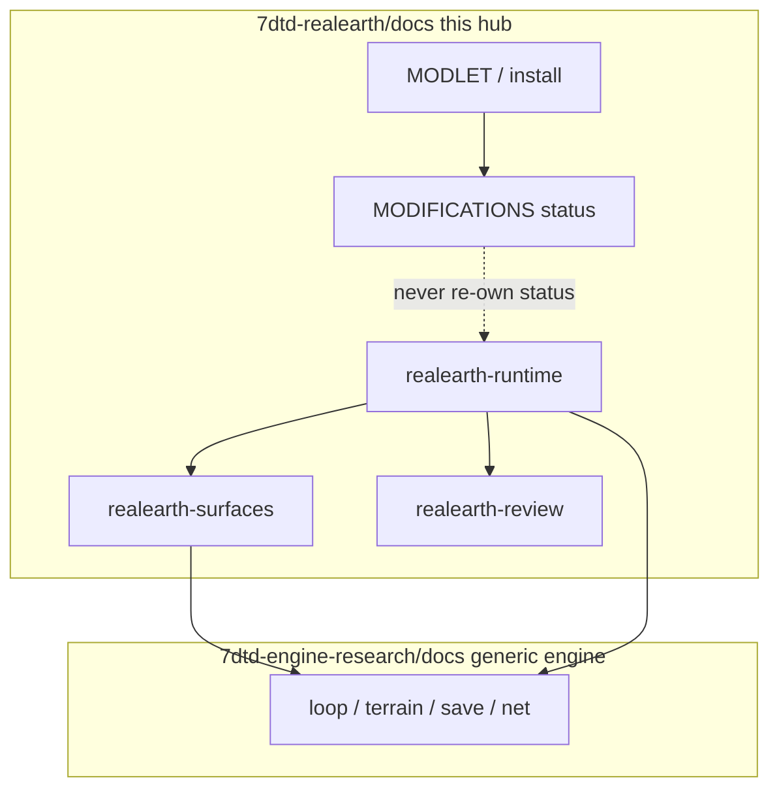

# RealEarth documentation index

**Owns:** product documentation hub (ownership table, reading paths, state-machine jumps).  
**Not:** generic engine RE ([research INDEX](../../7dtd-engine-research/docs/INDEX.md)).  
**Start here.** One hub so other docs do not re-list everything.

**Game:** 7DTD V3.1.0 · **Product:** 1:1 Earth geography + population density

**Ownership split:** product docs = RealEarth design, status, Streamed lessons.  
**Generic dedicated engine RE** (gmUpdate, AI, net packages, stock height APIs) lives under [`../../7dtd-engine-research/docs/INDEX.md`](../../7dtd-engine-research/docs/INDEX.md). Do not copy status tables into research.

---

## One home per topic (no duplicate status tables)

| Topic | Owns it | Do not re-author in |
|---|---|---|
| Operator install / expand / config keys | [`MODLET.md`](MODLET.md) | README (link only) |
| Proton paths on this machine | [`PROTON_INSTALL.md`](PROTON_INSTALL.md) | MODLET (link) |
| Product architecture / phases / ideas | [`../DESIGN.md`](../DESIGN.md) | README ideas lists |
| Prioritized implement order P0-P8 | [`IMPLEMENTATION_PLAN.md`](IMPLEMENTATION_PLAN.md) | chat-only plans |
| Stock engine limits (1:1 Earth) | [`ENGINE_LIMITATIONS.md`](ENGINE_LIMITATIONS.md) | HEIGHT (policy only) |
| Generic dedi ceilings (any server) | [`../../7dtd-engine-research/docs/engine-limitations.md`](../../7dtd-engine-research/docs/engine-limitations.md) | product status / RealEarth attack paths |
| Vertical product policy + expand | [`HEIGHT_LIMITS.md`](HEIGHT_LIMITS.md) | ENGINE (limits only) |
| Future sparse Y | [`DYNAMIC_CHUNK_HEIGHT.md`](DYNAMIC_CHUNK_HEIGHT.md) | HEIGHT |
| **Status of each product surface** | [`MODIFICATIONS.md`](MODIFICATIONS.md) | GAP (implementation how) |
| **How to close gaps + which 7D API** | [`GAP_HARMONY_MODLETS.md`](GAP_HARMONY_MODLETS.md) | MODIFICATIONS (status only) |
| Lon/lat math + distortion | [`LON_LAT.md`](LON_LAT.md) | Session docs (link) |
| Baked vs Streamed choice | [`SINGLE_WORLD.md`](SINGLE_WORLD.md) | ABSOLUTE (inject detail) |
| Streamed host window + install steps | [`HostWorld.md`](HostWorld.md) | ABSOLUTE (inject detail) |
| Absolute Earth → inject path | [`ABSOLUTE_STREAMING.md`](ABSOLUTE_STREAMING.md) | SINGLE (mode choice) |
| MP origin / bubbles | [`MULTIPLAYER_STREAMING.md`](MULTIPLAYER_STREAMING.md) | ABSOLUTE (one-line link) |
| Density → stamps | [`CITIES_AND_DENSITY.md`](CITIES_AND_DENSITY.md) | CITY_MAP (labels only) |
| Map name discovery | [`CITY_MAP_LABELS.md`](CITY_MAP_LABELS.md) | MODLET (config keys only) |
| Open data pointers | [`DATA_SOURCES.md`](DATA_SOURCES.md) | REALISM (policy) |
| Why not Google bulk | [`REALISM_AND_GOOGLE_EARTH.md`](REALISM_AND_GOOGLE_EARTH.md) | DATA_SOURCES |
| Execution checklist | [`../TODO.md`](../TODO.md) | DESIGN phases |
| **Generic engine RE hub** | [`../../7dtd-engine-research/docs/INDEX.md`](../../7dtd-engine-research/docs/INDEX.md) | product status / RealEarth lessons |
| Streamed runtime lessons | [`realearth-runtime.md`](realearth-runtime.md) | MODIFICATIONS (status only) |
| Engine surfaces used by RealEarth | [`realearth-surfaces.md`](realearth-surfaces.md) | research terrain-height / save-region |
| Adversarial review catalog | [`realearth-review.md`](realearth-review.md) | MODIFICATIONS (status only) |
| Attack surface / threat model + security policy | [`THREAT_MODEL.md`](THREAT_MODEL.md) + [`../SECURITY.md`](../SECURITY.md) | realearth-review (robustness only), MODIFICATIONS (status) |
| Height YDim / stock APIs (generic RE) | [`../../7dtd-engine-research/docs/terrain-height.md`](../../7dtd-engine-research/docs/terrain-height.md) | HEIGHT_LIMITS (product policy) |

**Status tags** (MODIFICATIONS + TODO only): **Done** · **Partial** · **Needed** · **Later** · **Ops**.  
Never mark Done without live measure (GAP evidence checklist).

---

## Outside `docs/`

| File | Role |
|---|---|
| [`../README.md`](../README.md) | Quick start, Makefile, v0.1 status |
| [`../DESIGN.md`](../DESIGN.md) | Architecture, phases, idea backlog §18 |
| [`../AGENTS.md`](../AGENTS.md) | Repo rules for agents |
| [`../TODO.md`](../TODO.md) | Executable backlog |
| [`../ATTRIBUTION.md`](../ATTRIBUTION.md) | Licenses |
| [`../../MODDING_BEST_PRACTICES.md`](../../MODDING_BEST_PRACTICES.md) | Workspace 7D modding layers |

---

## Reading paths

**New operator:** [MODLET](MODLET.md) → [PROTON_INSTALL](PROTON_INSTALL.md) → [HEIGHT_LIMITS](HEIGHT_LIMITS.md) → [SINGLE_WORLD](SINGLE_WORLD.md)

**Product intent:** [DESIGN](../DESIGN.md) → [ENGINE_LIMITATIONS](ENGINE_LIMITATIONS.md) → [MODIFICATIONS](MODIFICATIONS.md)

**Implement / retarget:** [GAP_HARMONY_MODLETS](GAP_HARMONY_MODLETS.md) → [research INDEX](../../7dtd-engine-research/docs/INDEX.md) → [realearth-runtime](realearth-runtime.md) → [realearth-surfaces](realearth-surfaces.md) → [TODO](../TODO.md)

**Generic engine RE:** [research INDEX](../../7dtd-engine-research/docs/INDEX.md) → [coverage](../../7dtd-engine-research/docs/coverage.md)

**Streamed product deep-dive:** [realearth-runtime](realearth-runtime.md) → [realearth-surfaces](realearth-surfaces.md) → [realearth-review](realearth-review.md)

**Data / cities:** [DATA_SOURCES](DATA_SOURCES.md) → [CITIES_AND_DENSITY](CITIES_AND_DENSITY.md) → [CITY_MAP_LABELS](CITY_MAP_LABELS.md)

**Stream / MP:** [SINGLE_WORLD](SINGLE_WORLD.md) → [ABSOLUTE_STREAMING](ABSOLUTE_STREAMING.md) → [MULTIPLAYER_STREAMING](MULTIPLAYER_STREAMING.md) → [LON_LAT](LON_LAT.md)

**Ideas (not backlog tickets):** [DESIGN.md](../DESIGN.md) §18 only. Do not copy idea tables elsewhere.

---

## All docs (flat)

| Doc | One line |
|---|---|
| [SECURITY](../SECURITY.md) | Reporting channel, scope, supported versions |
| [MODLET](MODLET.md) | Install, expand, config keys |
| [PROTON_INSTALL](PROTON_INSTALL.md) | Steam/Proton paths |
| [GAME_VERSION](GAME_VERSION.md) | Local pins |
| [HEIGHT_LIMITS](HEIGHT_LIMITS.md) | Real height policy |
| [ENGINE_LIMITATIONS](ENGINE_LIMITATIONS.md) | Stock blockers for 1:1 Earth (+ §7b other) |
| [research engine-limitations](../../7dtd-engine-research/docs/engine-limitations.md) | Generic dedi ceilings |
| [MODIFICATIONS](MODIFICATIONS.md) | Product surface status A-H |
| [IMPLEMENTATION_PLAN](IMPLEMENTATION_PLAN.md) | P0-P8 order, outcomes, test gates |
| [GAP_HARMONY_MODLETS](GAP_HARMONY_MODLETS.md) | Gaps + API choice (XPath/Harmony/…) |
| [LON_LAT](LON_LAT.md) | Dual coords, limits |
| [SINGLE_WORLD](SINGLE_WORLD.md) | One session; Baked vs Streamed |
| [ABSOLUTE_STREAMING](ABSOLUTE_STREAMING.md) | Absolute → sample → inject |
| [MULTIPLAYER_STREAMING](MULTIPLAYER_STREAMING.md) | Shared origin, bubbles |
| [DYNAMIC_CHUNK_HEIGHT](DYNAMIC_CHUNK_HEIGHT.md) | Sparse Y future |
| [CITIES_AND_DENSITY](CITIES_AND_DENSITY.md) | Density stamps |
| [CITY_MAP_LABELS](CITY_MAP_LABELS.md) | Discover-on-approach names |
| [DATA_SOURCES](DATA_SOURCES.md) | DEM/pop/landcover sources |
| [REALISM_AND_GOOGLE_EARTH](REALISM_AND_GOOGLE_EARTH.md) | Legal data policy |
| [MODDING_REFERENCES](MODDING_REFERENCES.md) | External sites |
| [RESEARCH_NOTES](RESEARCH_NOTES.md) | Living research notes |
| [RESEARCH_LOG](RESEARCH_LOG.md) | Chronological sessions |
| [realearth-runtime](realearth-runtime.md) | Streamed architecture lessons |
| [realearth-surfaces](realearth-surfaces.md) | Engine surfaces Streamed depends on |
| [realearth-review](realearth-review.md) | Adversarial failure catalog |
| [THREAT_MODEL](THREAT_MODEL.md) | Entry points, trust boundaries, ranked threats, mitigations map |

---

## Key state machines (product Streamed)

| Lifecycle | Doc |
|---|---|
| Session SharedFixed / SoloSlide | [realearth-runtime](realearth-runtime.md) §3 |
| Tile Cold/Hot/Miss | [realearth-runtime](realearth-runtime.md) §4 |
| Inject gate Applied/Blocked | [realearth-runtime](realearth-runtime.md) §5 |
| Origin FixedUpdate (client vs dedi) | [realearth-surfaces](realearth-surfaces.md) §3 |
| Claim remap on slide | [realearth-surfaces](realearth-surfaces.md) §4 |

Generic engine machines (gmUpdate, AI LOD, path, chunk flags, net bands): [research INDEX](../../7dtd-engine-research/docs/INDEX.md).

---

## Changelog

- **2026-08-23:** THREAT_MODEL + SECURITY registered (threat model owns attack-surface documentation).
- **2026-07-19:** ENGINE_LIMITATIONS §7b + link generic research engine-limitations map.
- **2026-07-19:** Ownership/related docs across product tree; thin GAME_VERSION/PROTON expanded; DYNAMIC_CHUNK phase table product-aligned.
- **2026-07-18:** Cross-tree related docs on LON_LAT / ABSOLUTE / SINGLE / HEIGHT / ENGINE / MODIFICATIONS / MP; HEIGHT bottom line aligned to expand-required policy.
- **2026-07-18:** Ownership diagram + Streamed state-machine jump list; research vs product split.
- **2026-07-18:** RealEarth runtime/surfaces/review live in this product docs tree; research/ keeps generic engine only.
- **2026-07-18:** Research links collapsed to research INDEX + coverage hub (less duplication).
- **2026-07-16:** Initial hub; later same day: ownership table, idea tables centralized in DESIGN only.
