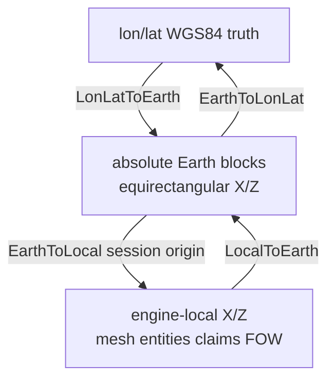

# Longitude / latitude: model, limitations, and gaps

**Owns:** equirectangular dual-coord model, distortion, wrap/poles, lon/lat gaps.  
**Not:** product status tables ([MODIFICATIONS](MODIFICATIONS.md)), Streamed inject architecture ([realearth-runtime](realearth-runtime.md)).  
**Session inject path:** [ABSOLUTE_STREAMING](ABSOLUTE_STREAMING.md). **Hub:** [INDEX](INDEX.md).

WGS84 lon/lat is geographic truth; the engine uses finite Cartesian X/Z. Mapping is equirectangular (+ optional regional bbox stretch).

---

## 1. Dual coordinate model

| Layer | What it is | Who owns it |
|---|---|---|
| **Lon/lat (truth)** | Degrees, WGS84-style; places, spawn, city pins, pack bbox | Pack data + `WorldSession` / pipeline |
| **Absolute Earth blocks** | Equirectangular integer grid (full planet or pack) | `EarthCoords` / `EarthGrid` |
| **Engine-local X/Z** | Host world coords the game mesh and entities use | 7DTD + optional origin slide |



```text
lon/lat  ──LonLatToEarth──►  absolute (ex, ez)  ──EarthToLocal──►  engine (lx, lz)
         ◄──EarthToLonLat──                  ◄──LocalToEarth──
```

**Product rule:** do not treat engine-local X/Z as “the real planet.” After an origin slide, the same lon/lat maps to a **different** local pair. City labels and streamer use session mapping for that reason.

Code:

| Piece | Role |
|---|---|
| `tools/realearth/coords.py` | Offline `lonlat_to_block` / `block_to_lonlat` |
| `Source/RealEarth/EarthCoords.cs` | In-game full-Earth equirectangular |
| `Source/RealEarth/WorldSession.cs` | Session origin, regional bbox, local ↔ Earth ↔ lon/lat |
| `tools/realearth/streamed_chunk.py` | Pack bbox linear map (offline sample) |

---

## 2. Full-Earth equirectangular formulas

Default grid (approx WGS84 meters as blocks):

| Constant | Value | Meaning |
|---|---|---|
| `EARTH_CIRCUMFERENCE_M` | 40 075 017 | Width (X), full longitude circle |
| `EARTH_MERIDIAN_HALF_M` | 20 003 931 | Height (Z), pole-to-pole arc |
| `DEFAULT_TILE_SIZE` | 512 | `.rte` tile edge |

```text
# LonLatToBlock (full Earth)
lon ∈ [-180, 180]   (wrap)
lat ∈ [-90, 90]     (clamp)
x = (lon + 180) / 360 * WorldWidth
z = (90 - lat) / 180 * WorldHeight

# BlockToLonLat
lon = (x / WorldWidth) * 360 - 180
lat = 90 - (z / WorldHeight) * 180
```

**Z increases southward** (north pole ≈ z=0, south pole ≈ z=max).

### Topology (not a sphere)

| Axis | Behavior | Implication |
|---|---|---|
| **X (longitude)** | Modular wrap when `EnableLongitudeWrap` (full planet) | Can circle the equator in data space |
| **Z (latitude)** | **Clamp** at poles | No path “over the pole” to the other side; not spherical topology |

The game world remains a **flat rectangle** (or a sliding window on one). Lon wrap is math on the grid, not a curved Earth mesh.

---

## 3. Regional packs (bbox stretch)

Most demos and height-test packs are **not** full-planet indices. Manifest has a lon/lat bbox and small `world_width` / `world_height` (e.g. 1024).

When `HasRegionalBbox` is true:

```text
fx = (lon - west) / (east - west)     # clamp lon into bbox first
fz = (north - lat) / (north - south)
earthX = fx * (WorldWidth - 1)
earthZ = fz * (WorldHeight - 1)
```

| Property | Effect |
|---|---|
| Lon/lat outside bbox | **Clamped** to edge (not rejected with error at runtime) |
| Aspect of bbox vs pack size | Geography is **linearly stretched** into the pack grid |
| `meters_per_block` / sample resolution | May be ≫ 1 m (e.g. 30-120 m/sample demos); “1 block = 1 m” product goal is not automatic for regional packs |
| `EnableLongitudeWrap` | Forced **off** when pack width &lt; 10 000 000 (`TryApplyPackManifest`) |
| Host larger than pack | **Fold** host X/Z into pack (repeat/tile) so inject still samples `.rte` | 

Folding means walking far on a small regional host can **revisit the same lon/lat patch**. That is a host/pack convenience, not “circling Earth.”

---

## 4. Limitations (current design)

### 4.1 Projection distortion

Equirectangular **does not** preserve true ground distance or area.

| Fact | Consequence |
|---|---|
| 1° longitude ≈ 111.3 km × cos(lat) | At 60°N, E-W ground distance per block is ~half of equator if X still uses full circumference |
| Full-Earth grid uses **one** X scale for all latitudes | High-latitude terrain is **east-west stretched** in block space relative to true meters |
| Meridian scale is roughly 1 m/block along Z | N-S is closer to product 1:1 than E-W at high lat |
| City `edge_radius_m` → discovery uses **Euclidean local blocks** | At high lat, “meters” edge is only approximate in block distance |

There is **no** WGS84 geodesic, UTM zone, or Web Mercator path in the runtime.

### 4.2 Integer blocks and quantization

| Issue | Detail |
|---|---|
| Lon/lat → int block | Sub-block position is truncated; round-trip drifts by up to ~1 block |
| Place pins | City centers snap to block centers (+0.5 for NavObject) |
| Dense urban stamps | Several real meters can collapse into one sample at coarse pack resolution |
| `BlockToLonLat` then `LonLatToBlock` | Not identity for all floats; tests only check coarse accuracy (e.g. NYC) |

### 4.3 Poles

| Issue | Detail |
|---|---|
| Lat clamped to ±90 | No over-pole travel |
| Pole cells | Entire longitude range maps into a short Z band; polar “circles” are tiny in Z but still full X width (classic equirectangular pathology) |
| DEM / tiles | Polar data often poor or missing; missing tile → 0 elev / ocean-like defaults |

### 4.4 Antimeridian (±180°)

| Issue | Detail |
|---|---|
| Point lon wrap | `LonLatToBlock` normalizes lon into [-180, 180] |
| Regional bbox | Assumes `east > west` continuous; cannot express a dateline-straddling region without a custom pack |
| Settlements | Places near ±180 work as points; area queries and pack bboxes that cross the dateline do not |

### 4.5 Engine-local vs lon/lat (origin slide)

| Issue | Detail |
|---|---|
| `LocalWindowSize` (default 1024) | Host canvas only; not the planet |
| `SoloSlide` | Recenters host on absolute Earth; **remaps** player local XZ |
| Stock UI / saves | Think in engine coords; RealEarth must re-derive lon/lat via session |
| NavObjects / claims / vehicles after slide | Re-pin labels implemented for cities; **claims/vehicles/POI permanence across slide** not fully proven |
| Debug FOW | Reveals host chunks, not “all lon/lat on Earth” |

### 4.6 What `BlockToLonLat` is not

`EarthCoords.BlockToLonLat` / `block_to_lonlat`:

- Is **not** the stock 7DTD map projection (stock map is host XZ, not WGS84).
- Does **not** account for DEM tile CRS differences (pipeline assumes equirectangular samples already).
- Does **not** convert geoid height; elevation is separate (meters ASL in tiles → game Y).
- Does **not** fix regional stretch: with a bbox, Earth block indices are pack-local, not planet absolute indices.
- Does **not** yield geodesic azimuth or great-circle distance.

For regional packs, prefer `WorldSession.EarthToLonLat` / `LonLatToEarth` (bbox path), not raw full-Earth `EarthCoords` alone.

### 4.7 Distance and “meters”

Product slogan is **1 m = 1 block** after Y expand for **height**, and for **horizontal** only under equirectangular + equator-ish assumptions.

| Measurement | Reality today |
|---|---|
| Vertical elev_m | Intended 1:1 after expand (`seaY + elev_m`) |
| Horizontal full Earth X | ~1 m at equator by construction of circumference |
| Horizontal full Earth at high lat | Cos(lat) shortfall: block ≠ true E-W meter |
| Regional pack cell | Often multi-meter sample (`resolution_m` / bake size) |
| City edge discovery | `hypot(local dx, local dz)` vs `edge_radius_m` as if 1 m = 1 block |

### 4.8 Multiplayer

| Issue | Detail |
|---|---|
| Shared combat space | Must share **one** absolute Earth story; not per-client lon/lat windows |
| `SoloSlide` | Fine solo; bad if two clients slide differently |
| `SharedFixed` | Freezes host origin; group stays co-located |
| Lon/lat authority | No dedicated net package for “player lon/lat”; derived from shared entity XZ + same session config |
| Cross-wrap entities | Land claims / vehicles / projectiles across antimeridian **not** fully validated |

---

## 5. What works today

| Capability | Status |
|---|---|
| Full-Earth equirectangular constants + wrap X / clamp Z | Implemented (Python + C#) |
| Regional bbox ↔ pack block linear map | Implemented |
| Session: local ↔ Earth ↔ lon/lat | Implemented (`WorldSession`) |
| Tile stream by absolute Earth position | Implemented (`TileStreamer`) |
| Spawn / sample CLI by lon/lat | Implemented (`realearth lonlat`, `sample-chunk`) |
| City catalog lon/lat → map pin at center | Implemented (discover-on-approach) |
| Pack manifest → width/height/bbox/wrap policy | Implemented (`TryApplyPackManifest`) |
| Host fold into small pack for inject | Implemented (regional demos) |

---

## 6. What is missing (gaps)

### 6.1 Coordinate / math

| Gap | Why it matters | Severity |
|---|---|---|
| **Latitude-correct horizontal meters** | Distances, edge radii, stamp spacing wrong at high lat | Medium (product honesty) |
| **Geodesic distance / bearing** | True “km to city,” navigation, globe UI | Later |
| **Antimeridian-safe bboxes** | Pacific packs, dateline travel | Medium for Pacific play |
| **Spherical / polar topology** | “Over the pole” paths | Hard / likely never in stock engine |
| **Sub-block / continuous lon-lat in engine** | Precision POIs, roads | Soft |
| **CRS transform pipeline** (EPSG in → equirect out) | Import GHSL/WorldPop/OSM without silent misalign | Needed for production farms |
| **Ellipsoid vs sphere constants** | Sub-km global consistency | Soft |

### 6.2 Session / engine integration

| Gap | Why it matters | Severity |
|---|---|---|
| **Save/reload absolute session** (origin, AbsoluteX/Z, wrap state) | Rejoin wrong place after quit | Needed |
| **Live inject retarget** every TFP build | Streamed lon/lat travel only as good as height inject | Hard (ongoing) |
| **Origin slide + land claim / bed / vehicle proof** | Soft-locks, lost bases | Needed (measure) |
| **Stock map / compass in lon-lat** | Player sees host coords, not degrees | Partial (city names only) |
| **Globe UI bound to session lon/lat** | DESIGN globe layer | Partial / later |
| **Fail-closed missing tiles** with clear lon/lat in logs | Wrong plains at unknown Earth pos | Partial |

### 6.3 Data and packs

| Gap | Why it matters | Severity |
|---|---|---|
| **Full-planet tile farm** with absolute indices | True circle-the-globe | Ops / data scale |
| **CDN + missing tile policy** | Ocean holes vs crash | Needed |
| **Urban polygons as first-class** (not only measured density blobs) | City edge fidelity | Partial (schema ready; bulk data not) |
| **Consistent 1 m/block regional bakes** | Demo packs often coarser | Policy + pipeline knobs |
| **Dateline-spanning settlements catalogs** | Split features | Later |

### 6.4 Multiplayer / ops

| Gap | Why it matters | Severity |
|---|---|---|
| **Server-authoritative absolute Earth** for distant groups | True multi-region MP | Needed / hard |
| **Identical expand + pack + bbox on all peers** | Desync | Ops |
| **Loadgen soak across wrap and slide** | Prove net + inject | Needed (`7dtd-loadgen`) |
| **Documented player-facing lon/lat debug** | Support (`recities` / future `relonlat`) | Soft |

### 6.5 Product UX

| Gap | Why it matters | Severity |
|---|---|---|
| HUD / F1: print player lon/lat | Orientation on real Earth | Easy win, not shipped as first-class |
| Map grid in degrees | Real atlas feel | Later |
| Discovery persistence by lon/lat across saves | Cities stay found | Missing (session-only labels) |

---

## 7. Implications for other systems

| System | Lon/lat dependence | Caveat |
|---|---|---|
| **City map labels** | Pin + discovery via `LonLatToLocal` | Edge meters ≈ blocks; high-lat / coarse packs distort “edge” |
| **Density / stamps** | Cores stored as lon/lat | Peak detect on pack raster, not geodesic area |
| **Height inject** | Sample by Earth block from local | Wrong session origin → wrong DEM cell |
| **FOW debug** | Host chunks only | Unrelated to “reveal this lon/lat on Earth” |
| **Viewer (browser)** | Full pack lon/lat for QA | Not the in-game discovery model |
| **MP combat** | Shared engine XZ | Sliding origins must not diverge |

---

## 8. Config knobs that change lon/lat behavior

| Key | Effect on lon/lat |
|---|---|
| `MapMode` | `Streamed` uses session absolute path; `Baked` is finite host (identity-ish) |
| `WorldWidth` / `WorldHeight` | Full Earth vs pack size (from manifest) |
| `EnableLongitudeWrap` | X modular wrap; off for small regional packs |
| `BboxWest/South/East/North` | Regional linear map; clamps queries |
| `LocalWindowSize` | How often origin slides (local ≠ stable planet frame) |
| `MultiplayerOriginMode` | `SoloSlide` vs `SharedFixed` |
| `SpawnLongitude` / `SpawnLatitude` | Session spawn Earth target |
| `TilePackPath` + `earth.manifest.json` | Source of width/height/bbox/wrap policy |

---

## 9. Practical guidance

1. **Regional play / demos:** treat lon/lat as labels inside the pack bbox; expect stretch if bbox aspect ≠ pack aspect; wrap is off.
2. **Planetary intent:** full-Earth width/height, `EnableLongitudeWrap=true`, absolute tile indices, accept equirectangular distortion at high lat until a lat-correct metric exists.
3. **Distances and city edges:** prefer measuring from **density map data** in pack space; do not assume geodesic km without conversion.
4. **Debugging “wrong city place”:** check session origin, pack bbox clamp, and whether you used full-Earth formulas on a regional pack (or the reverse).
5. **MP:** same pack, same expand, same origin mode; do not give each client a private lon/lat window.

---

## 10. Code map

| Path | Notes |
|---|---|
| `tools/realearth/coords.py` | Full-Earth map; point wrap only; no dateline split helper |
| `tools/realearth/streamed_chunk.py` | `lonlat_to_pack_block` bbox path |
| `Source/RealEarth/EarthCoords.cs` | WrapX, ClampZ, BlockToLonLat, LonLatToBlock |
| `Source/RealEarth/WorldSession.cs` | Dual frame, fold, LonLatToLocal / LocalToLonLat |
| `Source/RealEarth/ModApi.cs` | Manifest → width/bbox/wrap |
| `Source/RealEarth/CityMapLabels.cs` | Places in lon/lat; discovery in local blocks |
| `tools/tests/test_coords.py` | Basic round-trip / wrap / NYC smoke |

---

## 11. Status snapshot

Canonical Done/Partial/Needed lives in [MODIFICATIONS](MODIFICATIONS.md) only. This table is a lon/lat-scoped summary for readers of this file.

| Area | Status |
|---|---|
| Equirectangular dual coords | **Done** (scaffold + runtime) |
| Regional bbox packs | **Done** (with clamp + stretch) |
| Longitude wrap (data plane) | **Partial** (math yes; full-planet ops + live soak open) |
| True meters at all latitudes | **Missing** |
| Antimeridian regions | **Missing** |
| Save absolute lon/lat session | **Missing** |
| Geodesic / globe UX | **Missing** / partial design |
| Documented limits (this file) | **Done** |

---

## 12. Related docs

| Doc | Role |
|---|---|
| [ABSOLUTE_STREAMING](ABSOLUTE_STREAMING.md) | Absolute Earth → sample → inject path |
| [realearth-runtime](realearth-runtime.md) | Streamed session, tiles, inject gate, SoloSlide |
| [MULTIPLAYER_STREAMING](MULTIPLAYER_STREAMING.md) | SharedFixed vs SoloSlide for MP |
| [MODIFICATIONS](MODIFICATIONS.md) | Product surface status (section C coords) |
| [ENGINE_LIMITATIONS](ENGINE_LIMITATIONS.md) | Stock horizontal/topology blockers |
| [CITY_MAP_LABELS](CITY_MAP_LABELS.md) | Discovery pins via LonLatToLocal |
| Generic height APIs | [`../../7dtd-research/docs/terrain-height.md`](../../7dtd-research/docs/terrain-height.md) |

## Changelog

- **2026-07-18:** Dual-coord mermaid, ownership header, related docs; status table defers to MODIFICATIONS.
