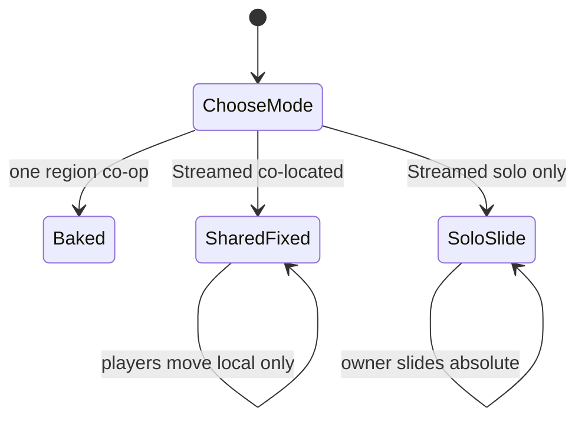

# Multiplayer + streaming: windows, chunks, shooting

**Owns:** SharedFixed vs SoloSlide, shared coords, tile bubbles for MP.  
**Not:** inject how-to ([ABSOLUTE_STREAMING](ABSOLUTE_STREAMING.md)), mode choice ([SINGLE_WORLD](SINGLE_WORLD.md)), product status ([MODIFICATIONS](MODIFICATIONS.md)), full session machines ([realearth-runtime](realearth-runtime.md)).  
**Hub:** [INDEX](INDEX.md).

## Vanilla already does the hard part

One shared coordinate space, chunk load/unload, cross-chunk combat. RealEarth does **not** invent netcode. It only answers: when a chunk is needed at (x,z), what Earth data fills it?

## Two different “windows” (do not confuse them)

| Layer | What it is | Multiplayer rule |
|---|---|---|
| **Earth tiles (`.rte`)** | Offline DEM/city data tiles (e.g. 512 m) | Stream **per player** around their Earth position (dynamic, overlapping bubbles). |
| **7DTD game chunks** | Engine 16×16 block columns | Already dynamic; leave as-is. |
| **LocalWindowSize host** | Size of the *single* Unity world mesh the engine holds | **One shared origin for the whole session**, not one window per player. |

Shooting, melee, vehicle rams, land claims: all need **shared absolute positions**.

## What goes wrong if each player has their own LocalWindow

If player A’s “local (0,0)” is Paris and player B’s is Tokyo:

- Their engines think both are near (0,0).
- A bullet from A toward B has no shared geometry.
- Inventory/bases/claims desync.

So: **LocalWindow origin is not per-client.** It is either:

1. **Shared sliding origin** (everyone remaps together; only safe if the group is co-located), or  
2. **No slide in multiplayer** (fixed host world + tile inject only), or  
3. **Baked map** (best MP story today: one 4k-16k GeneratedWorld, vanilla netcode).

## Recommended model

```
                    ┌─────────────────────────────────────┐
                    │  Server: one world, absolute Earth   │
                    │  coords (or one baked map coords)    │
                    └─────────────────────────────────────┘
                         ▲              ▲
           player A bubble│              │player B bubble
           stream tiles   │              │stream tiles
           near A         │              │near B
                    ┌─────┴────┐   ┌─────┴────┐
                    │ Client A │   │ Client B │
                    │ same net │   │ same net │
                    │ positions│   │ positions│
                    └──────────┘   └──────────┘
```

### Content streaming (dynamic, overlapping)

- `StreamRadiusTiles` = how many Earth tiles around **each** player are hot (e.g. 2-4 → ~1-2 km if tile=512).
- `UnloadRadiusTiles` = slightly larger (hysteresis so tiles do not thrash).
- Players far apart: bubbles **do not need to overlap**.
- Players near each other: bubbles **overlap heavily**, same tiles, same terrain.
- When A shoots B inside sim range: vanilla projectile / hitscan uses shared coords; tile load is irrelevant as long as both are spawned in the same session world.

### LocalWindowSize (host bound)

This only exists because the engine wants a **finite** world rectangle.

| Setting | Meaning |
|---|---|
| Small host (e.g. **1024**) | Less memory; enough if you stream tiles and do not need the whole host filled with mesh at once. |
| Large host (8192) | Heavy; only needed if you fill the whole host with terrain without aggressive unload. |

With true dynamic tile→chunk inject, prefer:

```json
"LocalWindowSize": 1024,
"StreamRadiusTiles": 3,
"UnloadRadiusTiles": 5,
"MultiplayerOriginMode": "SharedFixed"
```

(MP profile radii; solo shipped config uses stream 2 / unload 4.)

**SharedFixed** (default for MP): do not slide origin when any player is online; wrap or soft-limit travel, or use a large baked playable region.

**SharedSlide** (partial): currently slides only when the player count is 1, same as SoloSlide; proximity-based convoy sliding is not implemented yet.

**SoloSlide**: single-player only origin slide (current `WorldSession.TickPlayerLocal` behavior).

## “Should chunks be dynamic?”

**Yes** for Earth tiles and 7DTD chunks:

1. Game chunks already load/unload by distance (vanilla).
2. Earth `.rte` tiles should load/unload by distance per player (our streamer).
3. Overlap is automatic when players are close: both request the same tiles.

**No** for “each player lives in a private 8k world.”

## Combat across far distances

| Distance | Behavior |
|---|---|
| Within view/sim distance | Normal MP combat; both players’ tile bubbles likely overlap. |
| Beyond sim distance | You cannot shoot them in vanilla either; entity not simulated on your client. |
| Opposite sides of Earth | Need travel; not a “chunk seam” problem, a range problem. |

If you ever need ultra-long-range hits (sniper across unloaded terrain), that is a separate net design; vanilla does not do that.

## Why 8k LocalWindow is too much by default

- 8k×8k is ~64× the area of 1k×1k.
- Memory, gen time, and save weight scale badly.
- Streaming already limits **interesting** terrain to a few km around players.
- **Default should be 1024** (or 512 for height tests / co-located MP), with stream radius carrying play.

Baked playable maps can still be 4096-8192 for a full single-file region.

## Config sketch

```json
{
  "MapMode": "Streamed",
  "LocalWindowSize": 1024,
  "StreamRadiusTiles": 3,
  "UnloadRadiusTiles": 5,
  "TileSize": 512,
  "MultiplayerOriginMode": "SharedFixed",
  "EnableLongitudeWrap": true
}
```

Shipped template `Config/realearth.mp.json` keeps `EnableLongitudeWrap=false` for regional canvases; enable wrap only on a full-planet pack (manifest forces it off below 10M blocks).

Rough hot area per player at tile 512, radius 3: about **7×7 tiles ≈ 3.5 km × 3.5 km** of Earth data, independent of LocalWindowSize.

## Practical shipping advice

| Play style | Use |
|---|---|
| Friends on one continent / one city region | **Baked** 4k-8k world (simplest MP, works now) |
| Solo planetary travel | Streamed + SoloSlide + small LocalWindow |
| Dedicated multi-group on full Earth | Streamed + SharedFixed origin + per-player tile stream; no per-player windows |

## Operator config (dedicated)

Ship template: `Config/realearth.mp.json` (copied into `Mods/RealEarth/Config/realearth.json` by the height dedicated install).

Key fields:

| Key | MP value | Why |
|---|---|---|
| `MultiplayerOriginMode` | `SharedFixed` | One shared host origin; combat coords match |
| `MapMode` | `Streamed` | Absolute Earth tile inject |
| `StreamRadiusTiles` | `3` | ~3.5 km Earth data per player (tile 512) |
| `UnloadRadiusTiles` | `5` | Hysteresis so multi-center eviction is stable |
| `LocalWindowSize` | pack size (e.g. 512) or ≤2048 | Host mesh bound, not Earth extent |
| `EnableEngineHeightMod` | `true` | Tall columns; apply RealEarth YDim expand on **server + every client** |

```bash
# Expand Assembly-CSharp (server + client), install H500 pack, soak empty dedicated
make engine-expand
make dedicated-height-test

# Multiplayer model unit tests
make test-mp
```

### Per-player tile bubbles (runtime)

`TileStreamer` keeps a focus per entity id. Load = **union** of all player bubbles;
evict only tiles outside **every** focus unload radius. Far-apart groups keep their
own tiles; nearby groups share the same `.rte` set. Origin slide stays off under
`SharedFixed`.

### Load-test bots (separate project)

LiteNetLib join bots (probe, full join, wander until world death, respawn) live in the
sibling repo **`7dtd-loadgen`** (not in this tree). See that project’s README:

```bash
cd ../7dtd-loadgen   # or ~/Desktop/7dtd/7dtd-loadgen
make help
make selftest         # mock-server CI gate
make dedicated-4k     # RWG 4k with POIs/sleepers
make join             # bots vs live dedicated (port 26902)
```

## Summary

- **Shoot across “chunks”:** works if both players share world coordinates (vanilla rule).
- **Dynamic overlapping stream bubbles:** yes for Earth tiles; same idea as 7DTD chunk streaming.
- **Private LocalWindow per player:** no.
- **8k host:** unnecessary as default once tile stream is real; prefer **~1024** + stream radius.
- **Dedicated MP template:** `Config/realearth.mp.json` + `make dedicated-height-test`.
- **Capacity / soak bots:** sibling project `7dtd-loadgen`.



Session/claim machines in full: [realearth-runtime](realearth-runtime.md) §3, [realearth-surfaces](realearth-surfaces.md) §3-4. Status: [MODIFICATIONS](MODIFICATIONS.md) section F.

## Related docs

| Doc | Role |
|---|---|
| [SINGLE_WORLD](SINGLE_WORLD.md) | Baked vs Streamed choice |
| [ABSOLUTE_STREAMING](ABSOLUTE_STREAMING.md) | Tile inject path |
| [LON_LAT](LON_LAT.md) | Shared lon/lat authority |
| [realearth-runtime](realearth-runtime.md) | SoloSlide / SharedFixed architecture |
| [realearth-surfaces](realearth-surfaces.md) | Origin dedi no-op; claim remap |
| [MODIFICATIONS](MODIFICATIONS.md) | MP persistence status |
| Loadgen | [`../../7dtd-loadgen/docs/REALEARTH.md`](../../7dtd-loadgen/docs/REALEARTH.md) |

## Changelog

- **2026-07-18:** Ownership header; origin mode state sketch; related docs.
