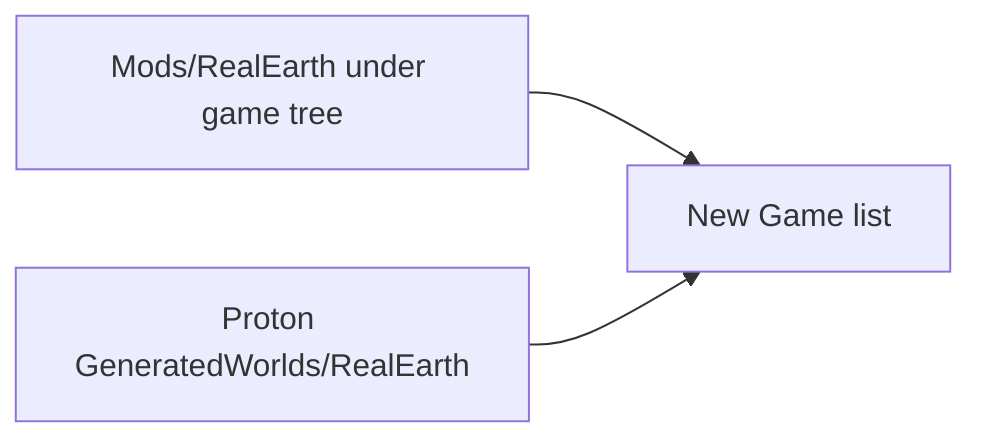

# Steam / Proton install (Windows client)

**Owns:** Proton userdata paths and client New Game install layout for this machine.  
**Not:** full product install matrix ([MODLET](MODLET.md)), version pin ([GAME_VERSION](GAME_VERSION.md)).  
**Hub:** [INDEX](INDEX.md).

The Windows build under Proton does **not** use `~/.local/share/7DaysToDie` for player data.

Client log on this machine:

```
UserDataFolder: C:\users\steamuser\AppData\Roaming/7DaysToDie
```

Linux host path:

```
~/.local/share/Steam/steamapps/compatdata/251570/pfx/drive_c/users/steamuser/AppData/Roaming/7DaysToDie
```

Generated worlds must be installed under that folder’s `GeneratedWorlds/`, or New Game will not list them.



## Paths (this machine)

| Item | Path |
|---|---|
| Game (Windows/Proton) | `~/.local/share/Steam/steamapps/common/7 Days To Die` |
| Mods (client) | `…/7 Days To Die/Mods/RealEarth/` |
| Harmony (keep) | `…/Mods/0_TFP_Harmony/` |
| **Proton userdata** | `…/compatdata/251570/pfx/drive_c/users/steamuser/AppData/Roaming/7DaysToDie` |
| **World for New Game** | `…/7DaysToDie/GeneratedWorlds/RealEarth/` |
| Dedicated server (Linux) | `…/7 Days to Die Dedicated Server` |
| Native Linux userdata (optional / server tests) | `~/.local/share/7DaysToDie` |

## After a Steam update

Steam can replace game files and leave an old `RealEarth.dll` that no longer matches `Assembly-CSharp`. Always re-run:

```bash
export SEVENDTD_GAME_DIR="$HOME/.local/share/Steam/steamapps/common/7 Days To Die"
./scripts/install_proton.sh
```

If product height is required, also `make engine-expand` (Verify restores stock YDim).

Earlier verification (before the current V3.1.0 pin, see [GAME_VERSION](GAME_VERSION.md)): dedicated **V 3.0.1 (b4)** loaded RealEarth + `World.Load: RealEarth`.

## One-shot install

```bash
export SEVENDTD_GAME_DIR="$HOME/.local/share/Steam/steamapps/common/7 Days To Die"
./scripts/install_proton.sh
```

The script:

1. Builds `RealEarth.dll` against client Managed + `0Harmony`
2. Installs `Mods/RealEarth/` under the game dir (and dedicated server if present)
3. Copies `worlds/RealEarth` into **Proton** `GeneratedWorlds/` (and optionally native Linux for dedicated tests)

## Play

1. Steam → 7 Days to Die (Proton)
2. **New Game** → select **RealEarth**
3. Confirm client log under Proton userdata `logs/` contains `[RealEarth] RealEarth init OK`

## Rebuild world

```bash
cd tools && uv sync --locked --extra dev
uv run --locked python -m realearth.cli bake-world --pack ../data/samples/demo_region --size 4096 \
  --name RealEarth --out ../worlds/RealEarth --generated
./scripts/install_proton.sh
```

## Layout check

```
# Mod (game install)
…/7 Days To Die/Mods/RealEarth/ModInfo.xml
…/7 Days To Die/Mods/RealEarth/RealEarth.dll
…/7 Days To Die/Mods/0_TFP_Harmony/ # do not delete

# World (Proton Windows userdata - required for client New Game)
…/compatdata/251570/…/Roaming/7DaysToDie/GeneratedWorlds/RealEarth/dtm.raw
…/compatdata/251570/…/Roaming/7DaysToDie/GeneratedWorlds/RealEarth/map_info.xml
```

## Related docs

| Doc | Role |
|---|---|
| [MODLET](MODLET.md) | Product install + expand |
| [GAME_VERSION](GAME_VERSION.md) | V3.1.0 pin |
| [SINGLE_WORLD](SINGLE_WORLD.md) | Baked vs Streamed |
| [HEIGHT_LIMITS](HEIGHT_LIMITS.md) | Expand for real height |

## Changelog

- **2026-07-19:** Ownership; mermaid path split; uv pipeline; related docs; expand after Verify.
