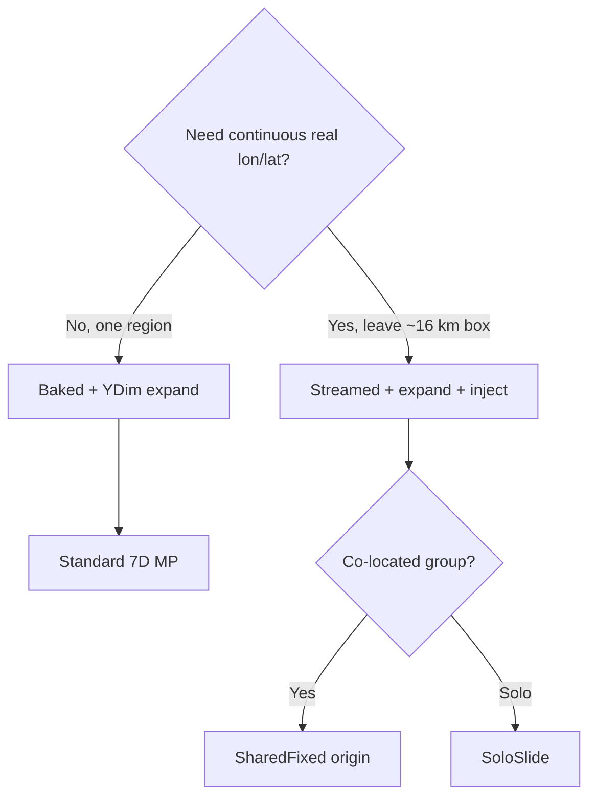

# One large map in-game

**Owns:** Baked vs Streamed **choice**, one continuous session policy.  
**Not:** inject pipeline details ([ABSOLUTE_STREAMING](ABSOLUTE_STREAMING.md)), MP origin rules ([MULTIPLAYER_STREAMING](MULTIPLAYER_STREAMING.md)), product status ([MODIFICATIONS](MODIFICATIONS.md)).  
**Hub:** [INDEX](INDEX.md).

Goal: one continuous playable world in a single 7DTD save. No hopping between separate maps.

## Engine limit (why two modes exist)

Practical loaded edge ~**16 km**. Planet at 1 m/block is ~40,000 km. Continuous Earth is **virtual absolute data + stream**, not a bigger heightmap. Full limit table: [ENGINE_LIMITATIONS](ENGINE_LIMITATIONS.md).



## Modes

### A) `Baked` (simplest MP today)

- One GeneratedWorld (about 2k-16k) with heightmap + biomes + density stamps.
- Vanilla netcode; install under Proton GeneratedWorlds (see [PROTON_INSTALL](PROTON_INSTALL.md)).
- Still needs **YDim expand** for real mountain height ([HEIGHT_LIMITS](HEIGHT_LIMITS.md)).
- **Use when:** one region, friends, fewest moving parts.

### B) `Streamed` (planetary travel)

- Same vanilla chunk load rules and combat; RealEarth only supplies DEM when a chunk is needed.
- Small host (`LocalWindowSize`, default **1024**) + tile bubble; origin may slide (SoloSlide).
- Inject path and config keys: [ABSOLUTE_STREAMING](ABSOLUTE_STREAMING.md).
- Architecture lessons: [realearth-runtime](realearth-runtime.md).
- Status: architecture Partial; live inject retarget still open ([GAP](GAP_HARMONY_MODLETS.md), [MODIFICATIONS](MODIFICATIONS.md)).
- **Use when:** leaving the ~16 km box; continuous lon/lat.

```json
"MapMode": "Streamed",
"LocalWindowSize": 1024,
"StreamRadiusTiles": 2,
"UnloadRadiusTiles": 4,
"MultiplayerOriginMode": "SoloSlide"
```

## Decision guide

```text
One region, co-op, simple     → Baked + expand
Cross real Earth coordinates → Streamed + expand + proven inject
Console crossplay (EAC on)   → not RealEarth C# (see workspace MODDING_BEST_PRACTICES)
```

## Defaults

- Baked: shipped “it just works” path for a finite region.
- Streamed: SoloSlide + small host (product architecture for planet).
- MP co-located on Streamed: prefer **SharedFixed** ([MULTIPLAYER_STREAMING](MULTIPLAYER_STREAMING.md)).

City labels / FOW: [CITY_MAP_LABELS](CITY_MAP_LABELS.md), [MODLET](MODLET.md) config keys.

## Related docs

| Doc | Role |
|---|---|
| [ABSOLUTE_STREAMING](ABSOLUTE_STREAMING.md) | Absolute → sample → inject |
| [LON_LAT](LON_LAT.md) | Dual coords after slide |
| [MULTIPLAYER_STREAMING](MULTIPLAYER_STREAMING.md) | Origin modes for groups |
| [realearth-runtime](realearth-runtime.md) | Session / tile / inject machines |
| [HEIGHT_LIMITS](HEIGHT_LIMITS.md) | Expand required for real height |
| [MODIFICATIONS](MODIFICATIONS.md) | Status for both modes |

## Changelog

- **2026-07-18:** Mode decision mermaid; related docs; status defers to MODIFICATIONS.
