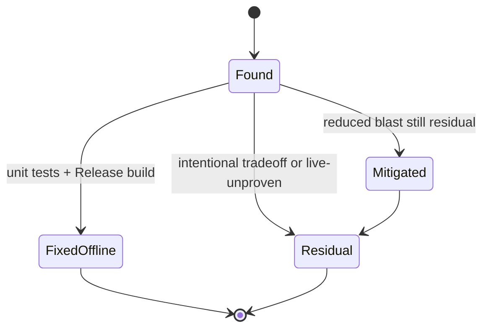

# RealEarth adversarial review findings

**Owns:** failure-class catalog from Streamed adversarial reviews.  
**Not:** product status tables ([MODIFICATIONS](MODIFICATIONS.md)), full architecture ([realearth-runtime](realearth-runtime.md)).  
**Architecture:** [`realearth-runtime.md`](realearth-runtime.md).  
**Engine surfaces:** [`realearth-surfaces.md`](realearth-surfaces.md).  
**Generic engine RE:** [`../../7dtd-research/docs/INDEX.md`](../../7dtd-research/docs/INDEX.md).  
**Product status dashboard:** [`MODIFICATIONS.md`](MODIFICATIONS.md) only (do not re-list Done/Partial here).  
**Hub:** [`INDEX.md`](INDEX.md).

Campaigns (scratch under `/tmp/grok-1000/`, not checked in):

| Scratch | Notes |
|---|---|
| `realearth-adv10-2091165` | Early ten-round (dedicated absolute, dual-fill, POI budget, FOW) |
| `re-adv10-1784267337` | GameManager PPL, inject sync-load, focus 0 |
| `re-adv-1784268066` | WaitForHotOrClaim, CDN sync gen, SetBlock, slide rollback |
| `re-adv-1784275128` | Miss cache bypass, tall crust, PublishTileBytes, claim stage-commit |

Offline bar after campaigns: Release build exit 0, `make test-mp` green, Python phase/height/density suites green. **Open critical/bug after last campaign: 0** (residual risks remain; see §4).

Architecture state machines for the same domains live in [`realearth-runtime.md`](realearth-runtime.md) (tiles, inject gate, SoloSlide) and [`realearth-surfaces.md`](realearth-surfaces.md) (Origin, claims).

---

## 1. How to read this catalog

Each class lists:

- **Symptom** (what broke or would break live)
- **Root cause**
- **Fix pattern** (what the code should do)
- **Anchors** (types / modules)

Status tags:

| Tag | Meaning |
|---|---|
| **Fixed offline** | Code + unit/structure tests |
| **Mitigated** | Reduced blast radius; residual remains |
| **Residual** | Known open risk; not falsely Done |
| **Discipline** | Process / status rule, not a single bug |

---

## 2. Failure classes (fixed offline)

### 2.1 Tile readiness races (permanent ocean)

| | |
|---|---|
| **Symptom** | Chunks generate as flat ocean forever near real land; later async load never rewrites |
| **Root cause** | Gen path samples before hot set ready; miss TTL blocks sync retry; CDN only async |
| **Fix pattern** | Inject calls `EnsureHotAround(..., allowSyncLoad: true)`; `WaitForHotOrClaim` waits in-flight async; miss TTL **bypassed** when `allowSyncLoad`; gen may `TryLoadCdnSync` |
| **Anchors** | `TileStreamer`, `ChunkTerrainInject`, `ChunkTerrainSampler` |
| **Status** | Fixed offline |

### 2.2 Tall-column gen hang / full Reflect

| | |
|---|---|
| **Symptom** | Everest-class columns hang GenerateTerrain or thrash CPU |
| **Root cause** | Full solid block fill 0..surface for ~8k heights via Reflect |
| **Fix pattern** | Dual-fill hardMax (e.g. 2048) for full solid; above that density+blocks **crust + plug + air** only |
| **Anchors** | `ChunkTerrainInject` tall band constants |
| **Status** | Fixed offline; hollow interiors **intentional residual** |

### 2.3 Stamp / height uint8 wrap

| | |
|---|---|
| **Symptom** | Prefabs bury or float at H500+; surface Y wraps at 256 |
| **Root cause** | Density stamp path used byte / uint8 surface Y |
| **Fix pattern** | `StampSurfaceY` / planner int32; tests assert H500 preservation |
| **Anchors** | `tools/realearth/density.py`, `StampSurfaceY.cs` |
| **Status** | Fixed offline |

### 2.4 Dead DensityBudget

| | |
|---|---|
| **Symptom** | Cap never applied; stamp floods |
| **Root cause** | Budget type unused in planner |
| **Fix pattern** | Wire `clamp_prefabs_in_chunk` / budget into stamp planner; unit tests for cap |
| **Anchors** | `DensityBudget`, density stamp planner |
| **Status** | Fixed offline |

### 2.5 EngineHeight fail-closed bypass

| | |
|---|---|
| **Symptom** | Product path still returns invented heights when tiles missing or expand required |
| **Root cause** | Guard not wired on product sample path |
| **Fix pattern** | `TileSamplePolicy` + `ExpandProductGuard` + `EnforceInjectGate` on product inject |
| **Anchors** | `EngineHeightMod`, `ExpandProductGuard`, `RuntimeHooks` |
| **Status** | Fixed offline; live proof still open |

### 2.6 Inject gate stuck blocked after catch

| | |
|---|---|
| **Symptom** | Healthy binds still `InjectBlocked` after exception path |
| **Root cause** | Catch / early return skipped `EnforceInjectGate` |
| **Fix pattern** | Apply catch + retry always re-run gate |
| **Anchors** | `RuntimeHooks.Apply` / `TryRetryApply` |
| **Status** | Fixed offline |

### 2.7 Double inject / prefetch confusion

| | |
|---|---|
| **Symptom** | ChunkIndex path rewrites columns twice or races gen |
| **Root cause** | Index postfix treated as full inject |
| **Fix pattern** | ChunkIndexPostfix **prefetch-only**; gen postfix owns column rewrite |
| **Anchors** | `RuntimeHooks` chunk index binds |
| **Status** | Fixed offline |

### 2.8 Patch apply false success

| | |
|---|---|
| **Symptom** | Mod claims applied with gen==0 or no useful binds |
| **Root cause** | `_applied` set too eagerly; retry skipped when already "applied" |
| **Fix pattern** | `_applied` only with useful binds; idempotent `PatchPostfix`; retry when gen missing |
| **Anchors** | `RuntimeHooks`, `_patchedMethods` |
| **Status** | Fixed offline |

### 2.9 Dedicated absolute origin never moves

| | |
|---|---|
| **Symptom** | Dedicated solo / empty server keeps wrong absolute window |
| **Root cause** | Absolute update only when "primary client" present |
| **Fix pattern** | `ShouldUpdateSessionAbsolute` when player count ≤ 1; CenterWindow honors flag |
| **Anchors** | `WorldSession`, `SessionOriginPolicy`, player tick |
| **Status** | Fixed offline |

### 2.10 Land claims permanently block SoloSlide

| | |
|---|---|
| **Symptom** | SoloSlide always denied; claims never found |
| **Root cause** | PPL resolved from World only; real list on **GameManager** |
| **Fix pattern** | Shared PPL resolver (`GameManager.GetPersistentPlayerList`); KeyValuePair unwrap; stage-commit claim remap |
| **Anchors** | `OriginSlideRemap` |
| **Status** | Fixed offline |

### 2.11 HasLandClaims fail-open vs fail-closed

| | |
|---|---|
| **Symptom** | Uninspectable claim APIs either corrupt claims or freeze slide |
| **Root cause** | Ambiguous reflection miss treated as "no claims" |
| **Fix pattern** | Uninspectable → **HasLandClaims true** (fail-closed freeze SoloSlide) |
| **Anchors** | `OriginSlideRemap.HasLandClaims` |
| **Status** | Fixed offline; residual: freeze if PPL truly missing on some builds |

### 2.12 Origin slide partial apply

| | |
|---|---|
| **Symptom** | Origin moves but entities stay; or claims half-remapped |
| **Root cause** | Non-atomic remap; TrySetPos ignore; cache not invalidated |
| **Fix pattern** | Stage claims → commit; entity pos failure **rolls back** origin; `InvalidateHotCache` after slide |
| **Anchors** | `OriginSlideRemap`, `WorldSession` |
| **Status** | Fixed offline; mesh reinject residual |

### 2.13 Float to block truncation

| | |
|---|---|
| **Symptom** | Negative local XZ off-by-one; wrong claim/label/height cell |
| **Root cause** | Cast truncates toward zero |
| **Fix pattern** | `Math.Floor` for world float → block indices |
| **Anchors** | Height args, entity pos, console rereveal/recities, ReadComp |
| **Status** | Fixed offline |

### 2.14 Sticky focus id 0

| | |
|---|---|
| **Symptom** | Spawn bubble wrong; RemoveFocus(0) nukes unrelated residency |
| **Root cause** | Fake focus 0 for spawn/world ready |
| **Fix pattern** | `EnsureHotAround` without sticky focus 0; PlayerUnload never RemoveFocus(0) for unknown remote |
| **Anchors** | `WorldSession` spawn/ready, `TileStreamer` |
| **Status** | Fixed offline |

### 2.15 Tile publish race

| | |
|---|---|
| **Symptom** | Readers see missing or partial tile mid-write |
| **Root cause** | Delete-then-move gap |
| **Fix pattern** | Unique temp + `File.Replace` (`PublishTileBytes`) |
| **Anchors** | `TileStreamer` publish path |
| **Status** | Fixed offline |

### 2.16 Air / mesh after inject

| | |
|---|---|
| **Symptom** | Stock floaters above DEM surface; mesh not dirty |
| **Root cause** | No air clear; SetBlockRaw only |
| **Fix pattern** | Clear air above surface (bounded +128); prefer SetBlock for dirty |
| **Anchors** | `ChunkTerrainInject` |
| **Status** | Fixed offline |

### 2.17 Session snapshot defaults wiped

| | |
|---|---|
| **Symptom** | Partial JSON blanks mode/wrap defaults |
| **Root cause** | Parse overwrote missing optional keys with empty |
| **Fix pattern** | `TryParse` keeps defaults for absent keys; restore wrap policy |
| **Anchors** | `SessionStateStore`, `SessionSnapshot` |
| **Status** | Fixed offline |

### 2.18 Map FOW / city label clamps

| | |
|---|---|
| **Symptom** | Reveal wrong chunks; unlimited labels; identity clamp |
| **Root cause** | FOW not per-chunk buffer; hardMax labels removed accidentally |
| **Fix pattern** | Per-chunk FOW buffer; city labels hardMax (e.g. 500) |
| **Anchors** | `MapReveal`, `CityMapLabels` |
| **Status** | Fixed offline |

### 2.19 POI place success lies

| | |
|---|---|
| **Symptom** | Budget and stats count failed void places |
| **Root cause** | Void prefab place returned success |
| **Fix pattern** | Place verify; OnOriginSlide keeps placed set (no re-stamp flood) |
| **Anchors** | `RuntimePoiInject` |
| **Status** | Fixed offline |

### 2.20 Stats path pollution

| | |
|---|---|
| **Symptom** | Unload or failed apply inflate inject / tick success |
| **Root cause** | Counters on wrong branch |
| **Fix pattern** | Inject count only successful apply; WorldReady resets; tick stats Update-only |
| **Anchors** | `ChunkTerrainInject`, `RuntimeHooks`, `InjectPatchStats` |
| **Status** | Fixed offline |

### 2.21 Console / compile hygiene

| | |
|---|---|
| **Symptom** | Missing `using System` for Math; test signatures drift |
| **Root cause** | Incomplete usings; test_mp not matching TickPlayerLocal |
| **Fix pattern** | Floor in console cmds; keep structure tests in lockstep with public signatures |
| **Anchors** | `ConsoleCmdReReveal`, `ConsoleCmdReCities`, `test_mp_runtime_structure` |
| **Status** | Fixed offline |

---

## 3. Skeptic / early phase lessons (pre multi-round campaigns)

These shaped P0-P8 offline cores:

| Finding | Consequence |
|---|---|
| EngineHeight fail-closed not wired | Product could claim 1:1 without expand or tiles |
| Stamp uint8 | Density stamps unusable above 255 |
| Dead DensityBudget | Cap theater |
| Offline pure modules first | ExpandProductGuard, HeightInjectMath, SessionOriginPolicy, StampSurfaceY, SessionStateStore, DensityBudget, CdnTilePolicy, SparseYScaffold |
| Live inject not Done | Status discipline: offline green ≠ live soak |

---

## 4. Residual risks (honest open set)

Do **not** erase these when campaigns report zero open critical/bug offline.

| Residual | Severity | Notes |
|---|---|---|
| **Live Harmony / inject soak** | High | Offline tests cannot bind real `Assembly-CSharp` gen path |
| **Live SharedFixed multi-bot** | High | Structure tests only |
| **SoloSlide mesh/voxel desync** | High | Mitigated (invalidate + prefetch); full chunk reinject still open |
| **Tall hollow interiors** | Medium | Intentional crust tradeoff above hardMax |
| **HasLandClaims freeze** | Medium | Fail-closed if PPL API missing on a build |
| **Broad Generate* chunk-index binds** | Medium | Prefetch-only by design; wrong bind set still fragile after TFP renames |
| **PrefabManager signature variance** | Medium | Reflection place may miss after updates |
| **Focus / bubble edge cases** | Low-Med | Spawn residency under multi-focus stress |
| **SharedSlide name overpromise** | Low | Config naming vs solo-only semantics |
| **`.7rg` tall-Y / light / stability** | High product | Expand soak + region save still Needed |
| **Steam Verify undoes expand** | Ops | Re-apply expand every update |
| **CDN / planet farm fail-closed live** | Product | Offline policy exists; farm ops Needed |

---

## 5. Review methodology that worked

1. **Full surface each round**, not only last diff: inject, streamer, session, slide, claims, density, console, tests.
2. **Fix then re-verify** offline: Release build + `make test-mp` + pytest suites.
3. **Separate residual from bug:** intentional hollow / offline-unproven live ≠ unfixed critical if documented.
4. **Fail-closed product defaults** over convenience (miss tiles, claims uninspectable, expand required).
5. **Counter honesty:** stats that lie hide broken gates.
6. **Do not mark Done** for live without dedicated evidence (goal harness rejection class).

---

## 6. Module map (where to look)

| Concern | Primary modules |
|---|---|
| Harmony bootstrap / gate | `RuntimeHooks`, `HarmonyBootstrap`, `InjectPatchStats` |
| Column inject | `ChunkTerrainInject`, `ChunkTerrainSampler` |
| Height product | `EngineHeight/*`, `HeightInjectMath`, `HeightQueryPatcher` |
| Tiles | `TileStreamer`, `RteTile`, `CdnTilePolicy`, `TileSamplePolicy` |
| Session | `WorldSession`, `SessionOriginPolicy`, `SessionStateStore`, `WorldSavePath` |
| Slide / claims | `OriginSlideRemap` |
| Density / POI | `RuntimePoiInject`, `DensityBudget`, `StampSurfaceY`, density.py |
| Cities / FOW | `CityMapLabels`, `MapReveal` |
| Expand guard | `ExpandProductGuard`, engine patcher tools |
| Console | `ConsoleCmdReHeight`, `ReInject`, `ReReveal`, `ReCities`, `ReSession` |

Offline tests:

| Suite | Role |
|---|---|
| `test_phase_cores.py` | P0-P8 pure cores |
| `test_height_inject_math.py` | Height math |
| `test_density_cities.py` | Density / stamps / edge radii |
| `test_mp_runtime_structure.py` / `make test-mp` | MP structure signatures |

---

## 7. Related docs

| Doc | Role |
|---|---|
| [`realearth-runtime.md`](realearth-runtime.md) | Architecture lessons |
| [`terrain-height.md`](../../7dtd-research/docs/terrain-height.md) | Height API / YDim RE |
| [`../../7dtd-realworld/docs/IMPLEMENTATION_PLAN.md`](../../7dtd-realworld/docs/IMPLEMENTATION_PLAN.md) | Priority + isolation bar |
| [`../../7dtd-realworld/docs/ENGINE_LIMITATIONS.md`](../../7dtd-realworld/docs/ENGINE_LIMITATIONS.md) | Stock limits + residual risk §10 |
| [`../../7dtd-realworld/docs/GAP_HARMONY_MODLETS.md`](../../7dtd-realworld/docs/GAP_HARMONY_MODLETS.md) | Gap × API matrix |

## Changelog

- **2026-07-18:** Consolidated multi-campaign adversarial findings + residual set into research docs.
