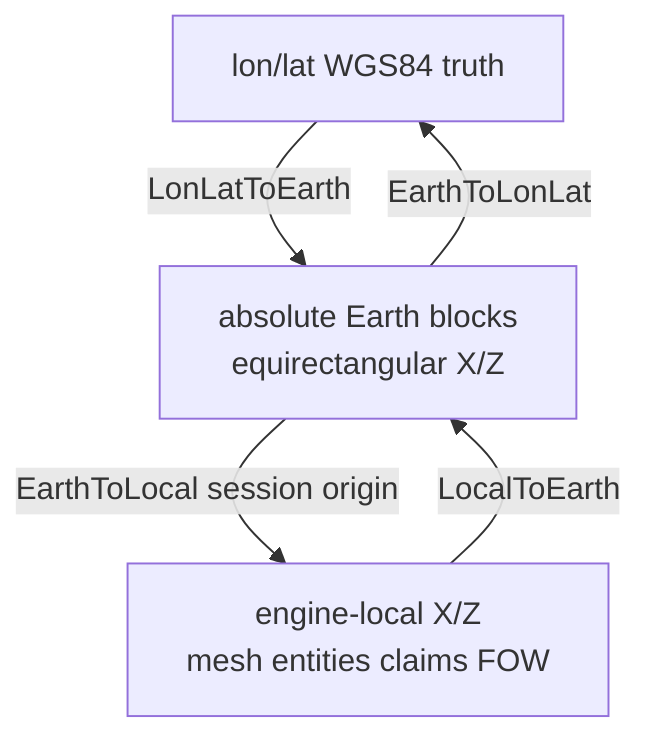
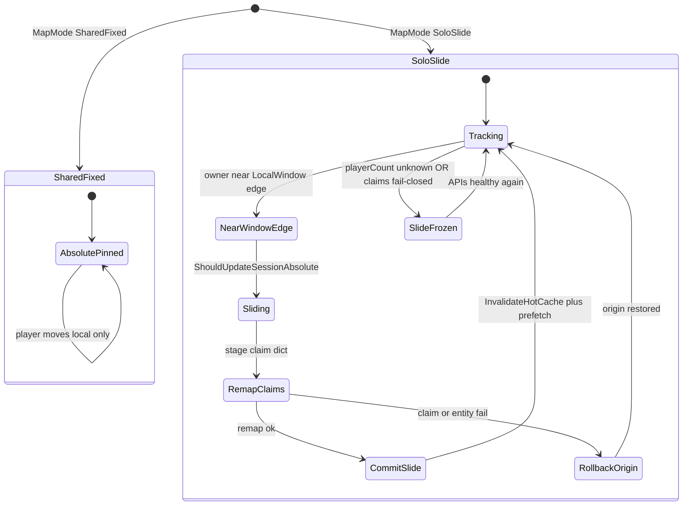
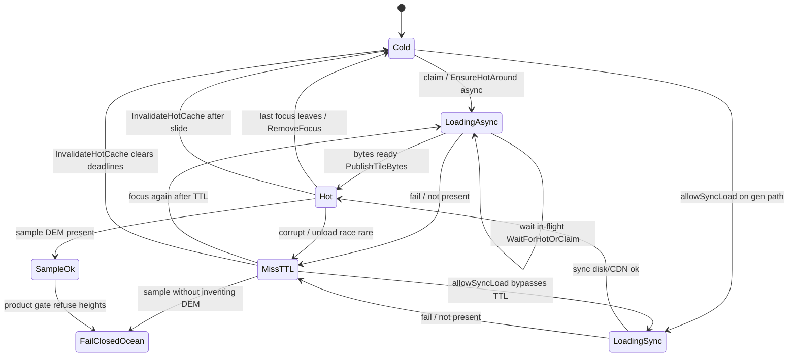
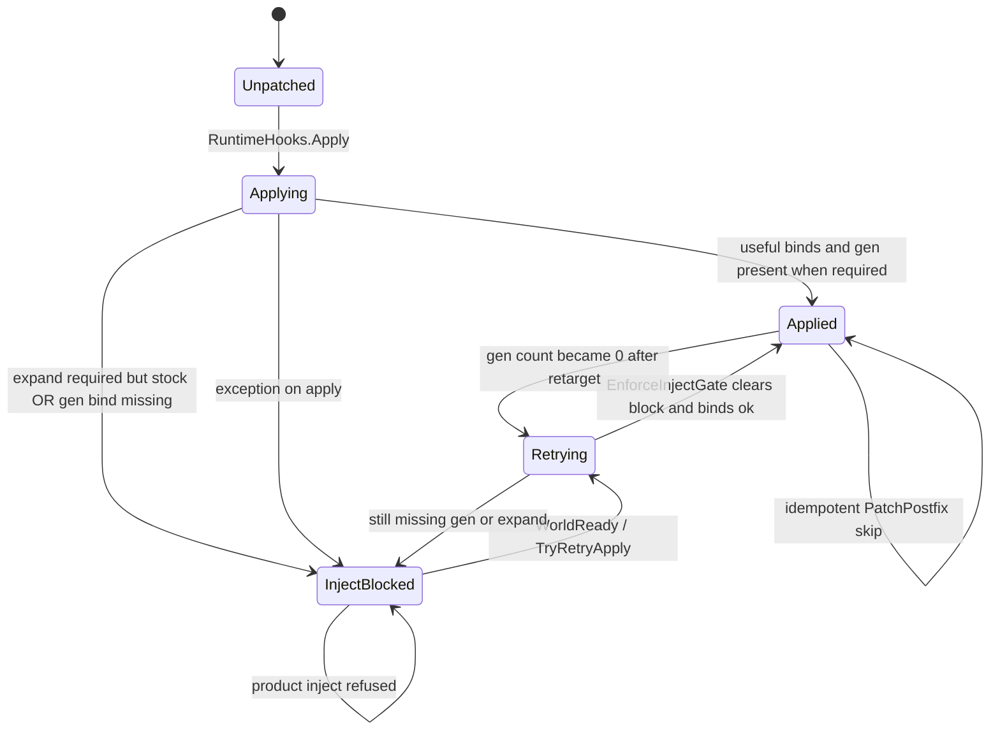
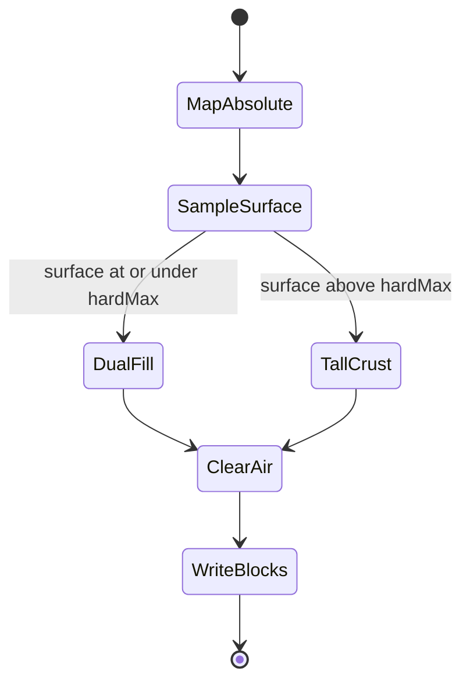
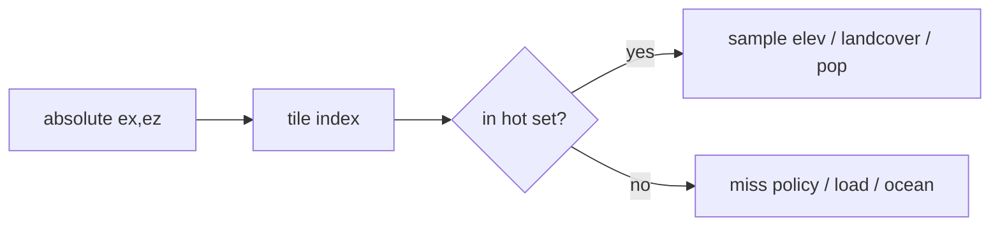

# RealEarth runtime architecture (lessons)

**Owns:** Streamed **architecture lessons** (coords, inject, tiles, session, tall fill).  
**Product status** (Done/Partial/Needed): [`MODIFICATIONS.md`](MODIFICATIONS.md) only. Never re-list status tables here.  
**Engine surfaces (product RE):** [`realearth-surfaces.md`](realearth-surfaces.md).  
**Adversarial catalog:** [`realearth-review.md`](realearth-review.md).  
**Lon/lat policy:** [`LON_LAT.md`](LON_LAT.md).  
**Generic height/loop RE:** [`../../7dtd-research/docs/terrain-height.md`](../../7dtd-research/docs/terrain-height.md), [`../../7dtd-research/docs/loop.md`](../../7dtd-research/docs/loop.md).  
**Hubs:** product [`INDEX.md`](INDEX.md) · engine [`../../7dtd-research/docs/INDEX.md`](../../7dtd-research/docs/INDEX.md).

Target game: **7DTD V3.1.0**.

---

## 1. What RealEarth actually is

Not an XML-only modlet. Product stack:

| Layer | Mechanism | Role |
|---|---|---|
| Offline packs | Python pipeline, `.rte` tiles, manifests | DEM, landcover, population density |
| Binary expand | Cecil patcher on `Assembly-CSharp` | YDim / layers / Y-bound IL (tall columns) |
| IModApi | `ModApi.InitMod` | Config, streamer, session, console |
| Harmony (stock `0_TFP_Harmony`) | Reflection-discovered Prefix/Postfix | Height queries, GenerateTerrain inject, player tick, world ready |
| Session | `WorldSession` + snapshot JSON | Absolute Earth origin, slide policy |

**Rule of thumb (product):** XML for data tables · IModApi for session/commands · Harmony for height/gen/tick · binary expand for YDim · packs for DEM. Never a second Harmony. Never private per-client origins.

---

## 2. Dual coordinate model (truth vs host)

Three layers must stay distinct:



| Rule | Why |
|---|---|
| Lon/lat is geographic truth | City pins, spawn, packs, discovery |
| Absolute blocks are streaming keys | Tile indices, height store, inject samples |
| Engine-local is a sliding host | Keep world coords bounded (`LocalWindowSize`) |

After an **origin slide**, the same lon/lat maps to a **different** local pair. Labels, streamer focus, claims, and entity remap must all use the same session mapping.

**Topology (not a sphere):**

| Axis | Behavior |
|---|---|
| X (longitude) | Modular wrap when enabled (full planet) |
| Z (latitude) | **Clamp** at poles (no over-pole path) |

Regional packs use bbox linear stretch (`HasRegionalBbox`). Full-planet and regional math must not be mixed without an explicit fold policy.

Code anchors:

| Piece | Role |
|---|---|
| `EarthCoords.cs` | Full-Earth equirectangular |
| `WorldSession.cs` | Origin, fold, local ↔ Earth ↔ lon/lat |
| `tools/realearth/coords.py` | Offline mirror |
| Product: `docs/LON_LAT.md` | Distortion, wrap, missing geodesic |

---

## 3. Session origin policies

| Mode | Absolute update | When |
|---|---|---|
| **SharedFixed** | Absolute origin fixed for the session | Multiplayer co-located groups |
| **SoloSlide** | Absolute follows the player; local recentered | Single player / dedicated solo |
| **SharedSlide** (name trap) | Config may exist; product must not promise multiplayer shared sliding origins | Solo-only semantics unless redesigned |

### 3.1 SharedFixed vs SoloSlide (session state)



**Learned:**

1. **Dedicated with zero clients** still needs absolute updates for server-side sim and diagnostics. Gate: `ShouldUpdateSessionAbsolute` treats `playerCount <= 1` as owner-updatable, not only "client is primary."
2. `CenterWindowOnAbsolute(updateAbsolute: …)` must honor the session owner flag. Updating absolute when SharedFixed (or multi-player slide deny) corrupts shared geography.
3. Fail closed when player count is **unknown** (reflection miss): do not slide.

---

## 4. Tile readiness and sample policy

Streamer holds a hot set of `.rte` tiles. Inject and height queries sample absolute Earth X/Z through that hot set.

### 4.1 Fail-closed missing tiles

Product path must **not invent DEM** on miss:

| Policy | Behavior |
|---|---|
| Missing / unload | Ocean / zero surface (or refused product height), counters bump |
| Present | Sample elevation + landcover |
| Fail-closed product inject | `EngineHeightMod` / sampler refuse fake peaks |

`TileSamplePolicy` and CDN policy (`CdnTilePolicy`) encode this. Silent "looks like mountains" from uninitialized memory or stock RWG is a product bug.

### 4.2 Tile readiness state machine

Per-tile states for the streamer hot set (product Streamed path):



| Path | Rule |
|---|---|
| Player tick / background | Prefer async claim + wait (do not block frame forever) |
| GenerateTerrain / inject | **May** `allowSyncLoad: true` so gen does not permanently write ocean |
| Miss cache TTL | Must **not** block `allowSyncLoad` forever (miss bypass on gen path) |
| CDN | Async by default; gen path may `TryLoadCdnSync` when sync is allowed |

**Race class fixed repeatedly:** chunk gen runs before hot tiles land → ocean columns forever.

1. `EnsureHotAround(..., allowSyncLoad: true)` on inject entry.
2. `WaitForHotOrClaim` waits out **in-flight** async before giving up.
3. Miss deadline does not sticky-block sync load on gen.

### 4.3 Hot cache lifecycle (events)

| Event | Transition |
|---|---|
| Last focus leaves tile | Hot → Cold; clear miss deadlines |
| `InvalidateHotCache` | Hot/MissTTL → Cold (both hot **and** miss TTLs) |
| `PublishTileBytes` | Loading → Hot via unique temp + `File.Replace` |
| `RemoveFocus` | When last focus leaves, clear that tile from hot |

`EnsureHotAround` vs `UpdateFromAbsolute`: multi-focus needs Ensure for bubble residency; sticky **focus id 0** at spawn was a real bug. Prefer Ensure without claiming focus 0 as a permanent fake player.

---

## 5. Inject path

### 5.1 Patch binding and inject gate state machine

Reflection Harmony discovery (not hard-typed only) targets:

- Concrete height APIs (float/int preferred; **byte returns stay lossy**)
- GenerateTerrain / provider fill → `ChunkTerrainInject`
- Chunk index hooks (prefetch-only; no double inject)
- World ready, player tick / unload



| Lesson | Detail |
|---|---|
| Interfaces unpatchable | Patch implementors only ([`terrain-height.md`](../../7dtd-research/docs/terrain-height.md)) |
| Product inject gate | `HasProductInjectBinding`: when expand required, **gen bind is mandatory** |
| `_applied` | Only when useful binds exist (do not claim success on empty) |
| Idempotent retry | `_patchedMethods` set; `TryRetryApply` retries when gen count is 0 |
| Catch path | Always re-run `EnforceInjectGate` (stuck InjectBlocked is worse than retry) |
| ChunkIndexPostfix | Prefetch tiles only; full column rewrite stays on GenerateTerrain path |

### 5.2 Column rewrite (`ChunkTerrainInject`)

For each column in the chunk:



1. Map local → absolute Earth.
2. Sample surface Y (int32, not uint8).
3. Write density + blocks under surface; clear air above (stock floaters).
4. Prefer `SetBlock` (mesh dirty) over raw silent writes where mesh matters.

**Tall columns (post-expand, e.g. Everest-class):**

| Band | Strategy |
|---|---|
| Dual-fill hardMax (e.g. 2048) | Full solid density+blocks to surface (performance-bounded) |
| Above hardMax | **Crust + plug + air only** (never Reflect-fill entire Everest solid) |
| Intentional hollow | Interior under crust may be empty; documented residual |

Full-column Reflect to ~8849 hangs gen and is not a product requirement for playable 1:1 surface.

### 5.3 Counters and diagnostics

| Counter / tool | Meaning |
|---|---|
| Session inject count / peak | Only on **successful** apply; reset on WorldReady |
| Miss / present tile hits | Fail-closed observability |
| Player tick stats | Count **Update** path only (unload success must not mask missing tick) |
| `reinject` / `reheight` | Console: force sync load + sample proof |
| `InjectPatchStats` | Bind counts, blocked flag |

---

## 6. Origin slide and claims

SoloSlide recenters the host window. Everything that stored **local** XZ must remap by delta.

| Surface | Policy |
|---|---|
| Player / entity positions | Remap; `TrySetPos` failure rolls back origin change |
| Land claims | Resolve PPL via **GameManager.GetPersistentPlayerList** (World-only was wrong → permanent deny) |
| Claim dict | Stage remap, then commit; restore on fail |
| Missing / uninspectable PPL | `HasLandClaims` **fail-closed** (freeze SoloSlide rather than corrupt claims) |
| Float → block | `Math.Floor` on XZ (truncation toward zero breaks negatives) |
| Tile hot cache | Invalidate after successful slide |
| Runtime POI stamps | Keep placed set across slide (no duplicate stamp); clear budget keys by FloorDiv |

**Residual:** SoloSlide mesh/voxel desync after slide is closed offline by `ChunkTerrainInject.ReinjectLoadedChunksAround` (slide path rewrites loaded chunk columns under the new origin, bounded radius + nearest-first cap; unloaded chunks regenerate naturally). Live soak still pending.

---

## 7. Persistence

| Artifact | Role |
|---|---|
| `realearth.session.v1` | Absolute origin, mode, wrap policy, spawn keys |
| Dual-write | GameIO save dir **and** mod Config (survive partial paths) |
| `SessionSnapshot.TryParse` | Missing optional keys must not blank defaults |
| Restore | Re-apply wrap policy; sync-load tiles around restored origin |

Stock save hook is still incomplete (product **Partial**). Snapshot format is the offline-proven core.

---

## 8. Density, stamps, cities

| Concern | Lesson |
|---|---|
| Surface Y for stamps | **int32** (`StampSurfaceY` / density planner); uint8 wraps at 256 and buries H500+ |
| DensityBudget | Real cap in planner (`clamp_prefabs_in_chunk`); dead budget code is a silent product hole |
| City labels | Discover at **edge** from map data (`edge_radius_m`); pin at geographic **center** |
| Label clamp | Hard max count (e.g. 500); identity clamp is not a budget |
| POI place | Void place must not count as success |
| FloorDiv keys | Budget / FOW / stamp keys must be stable under negative local coords |

---

## 9. Multiplayer honesty

| Claim | Bar |
|---|---|
| SharedFixed co-located | Offline structure tests exist; **live multi-bot soak still required** for Done |
| SoloSlide | Single-owner absolute update only |
| Private per-client Earth origins | **Forbidden** (breaks combat / claims / mesh) |
| Dedicated absolute | Update when `count <= 1` |

Offline `make test-mp` / phase tests are **structure and pure math**, not live Harmony proof.

---

## 10. Expand vs inject relationship

```text
Expand alone     → tall empty or stock RWG noise
Inject alone     → clamp / clip / product reject (no 1:1 Everest)
Expand + inject  → product path (still: light/stability/mesh soak Needed)
```

`ExpandProductGuard` refuses real-height product claims on stock YDim. Byte heightmaps (`World.GetTerrainHeight` → byte) remain **lossy** even after expand; drive float/int + block/density inject.

---

## 11. Verification bar (research + product discipline)

| Gate | Proves | Does not prove |
|---|---|---|
| Python pure tests (`test_phase_cores`, height, density) | Math, policy, stamp Y | Live mesh |
| C# net48 Release build | Compiles against refs | Runtime Harmony bind |
| `make test-mp` | MP structure / signatures | Live multiplayer |
| Loadgen self-test manifests | Scenario registry | Live inject walk |
| Dedicated soak H500 / Everest | Live inject | Full planet CDN |
| Live SharedFixed multi-bot | MP origin policy | Planet scale |

**Do not mark live inject/MP Done without dedicated evidence.**

Build note (this machine): `DOTNET_ROOT=~/.cache/dotnet-sdk` for RealEarth Release builds.

---

## 12. Related docs

| Doc | Role |
|---|---|
| [`MODIFICATIONS.md`](MODIFICATIONS.md) | Status Done/Partial/Needed |
| [`realearth-surfaces.md`](realearth-surfaces.md) | Engine surfaces Streamed depends on |
| [`realearth-review.md`](realearth-review.md) | Failure catalog + residual risks |
| [`LON_LAT.md`](LON_LAT.md) | Dual coords policy (product) |
| [`ABSOLUTE_STREAMING.md`](ABSOLUTE_STREAMING.md) | Absolute → sample → inject path |
| [`IMPLEMENTATION_PLAN.md`](IMPLEMENTATION_PLAN.md) | P0-P8 order |
| [`../../7dtd-research/docs/terrain-height.md`](../../7dtd-research/docs/terrain-height.md) | Stock vs expand height APIs (generic RE) |
| [`../../7dtd-research/docs/loop.md`](../../7dtd-research/docs/loop.md) | Dedicated frame/sim loop (generic RE) |
| [`INDEX.md`](INDEX.md) | Product hub |

## Changelog

- **2026-07-18:** Product-owned path; related docs + lon/lat links cleaned.  
- **2026-07-18:** Initial runtime lessons from P0-P8 offline cores + multi-campaign adversarial review.

---

# Appendix: coordinates and streaming checklist

Canonical lon/lat policy: [`LON_LAT.md`](LON_LAT.md). This appendix is the Streamed runtime checklist form of the same model.

## A1. Why dual coords exist

7DTD is a **finite flat Cartesian** world. Earth is **lon/lat on a sphere-ish ellipsoid**. RealEarth maps:

1. **Geographic truth** (degrees) for data and player-facing place names.
2. **Absolute Earth blocks** for tiles and DEM sampling (equirectangular meters-as-blocks).
3. **Engine-local** for mesh, physics, entities, land claims.

Streaming slides (3) while (1)/(2) stay continuous. Confusing any two layers produces wrong cities, wrong height, or broken multiplayer.

---

## A2. Equirectangular properties (limitations)

| Property | Implication for 1:1 |
|---|---|
| Constant degrees → meters on X | East-west scale correct only near reference (equator for full-Earth default) |
| Z clamp at poles | No polar topology; meridians meet only in data, not in walkable mesh |
| Lon wrap (optional) | Full-planet circle on X only when packs + config enable wrap |
| Regional bbox stretch | Demo packs distort scale to fit small world_width/height |
| Missing geodesic | Great-circle distance / true km at high lat **not** implemented |
| Missing antimeridian bbox | Pacific packs need split or specialized fold |

These are **documented product gaps**, not temporary bugs. See product `LON_LAT.md`.

---

## A3. Tile stream model



| Concept | Lesson |
|---|---|
| Stream radius | Bubble of tiles around focus absolute |
| Multi-focus | Multiple players/centers; last focus leave clears hot |
| Ensure vs Update | Ensure for residency without sticky fake focus ids |
| Sync load | Gen/inject only; not every tick |
| Fail-closed miss | Ocean / refuse product height; never random DEM |
| CDN | Optional URL policy; same fail-closed on miss |
| Publish atomicity | Replace, do not delete-gap |
| Invalidate on slide | Hot + miss TTL both clear |

---

## A4. Session modes (streaming policy)

| Mode | Absolute | Local | MP |
|---|---|---|---|
| SharedFixed | Fixed for session | Shared canvas | Co-located groups (product intent) |
| SoloSlide | Follows owner | Recenter when near window edge | Single owner only |
| Baked world | N/A (finite GeneratedWorld) | Stock world coords | Standard 7D MP |

**Single continuous session** (`SingleWorldSession`): one save story, not map-hop between regions. Streamed still uses one session origin narrative.

---

## A5. Origin slide checklist (research)

When absolute origin changes by `(dx, dz)` in local space:

1. Remap entities (rollback origin if pos set fails).
2. Remap land claims (stage → commit; fail-closed if PPL missing).
3. Invalidate tile hot + miss.
4. Prefetch hot around new absolute underfoot.
5. Do **not** re-stamp all POIs (keep placed set).
6. FOW / map buffers: per-chunk, keys FloorDiv-stable.
7. City labels: re-project via session mapping (lon/lat truth unchanged).
8. Re-inject loaded chunks around the player (`ReinjectLoadedChunksAround`): sync-load tiles, rewrite columns, SetBlock dirty meshes; nearest-first under a chunk cap.

**Not solved by checklist alone:** already-generated chunk voxels under old absolute. Closed offline by `ChunkTerrainInject.ReinjectLoadedChunksAround` on the slide path; live soak pending (see [`realearth-review.md`](realearth-review.md) §4).

---

## A6. City discovery geometry

| Field | Meaning |
|---|---|
| Center lon/lat | Pin / name position (trader-like) |
| Edge radius from map data | Discover when player approaches real urban extent |
| Not | Fixed game-band radii only |

Edge comes from density / settlement pipeline (`edge_radius_m`), not a constant "city ring." Product: `CITY_MAP_LABELS.md`.

---

## A7. Related (appendix)

Same hubs as §12. Prefer the main Related docs table for navigation; this appendix is the checklist form only.

| Doc | Role |
|---|---|
| [LON_LAT](LON_LAT.md) | Lon/lat policy (canonical) |
| [ABSOLUTE_STREAMING](ABSOLUTE_STREAMING.md) | Absolute → inject short path |
| [realearth-review](realearth-review.md) | Failure catalog |
| [research terrain-height](../../7dtd-research/docs/terrain-height.md) | Vertical engine limits |

## Changelog (appendix source)

- **2026-07-18:** Streaming/coord checklist merged from Streamed session work and adversarial slide/claim fixes; self-links cleaned.
