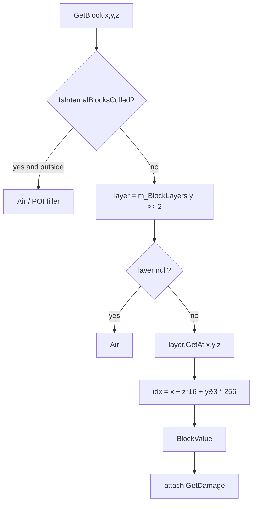
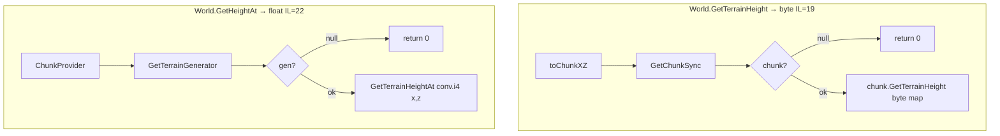
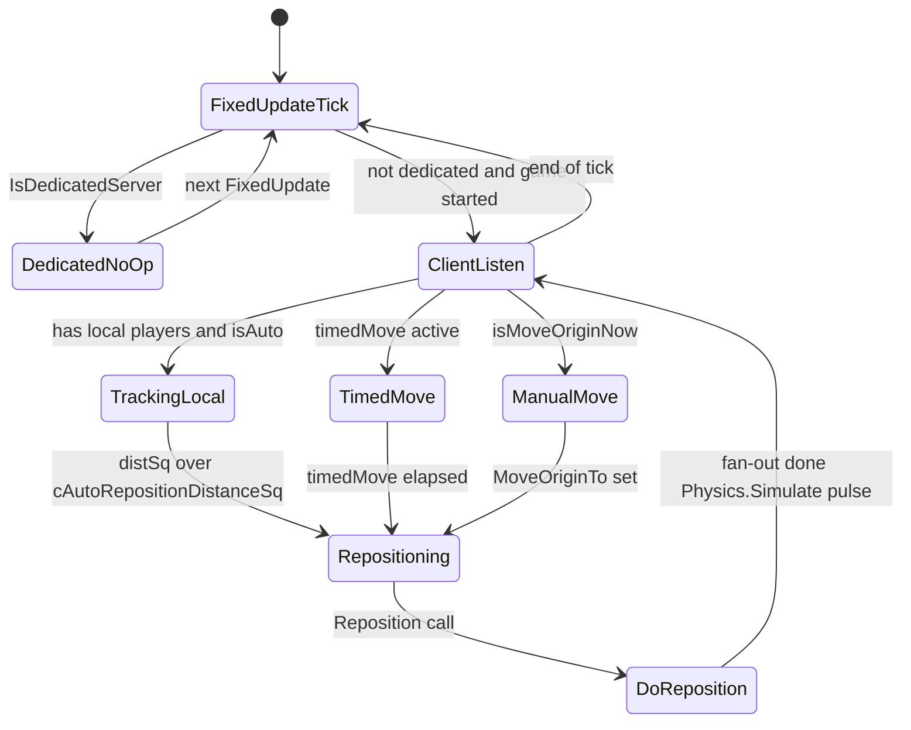
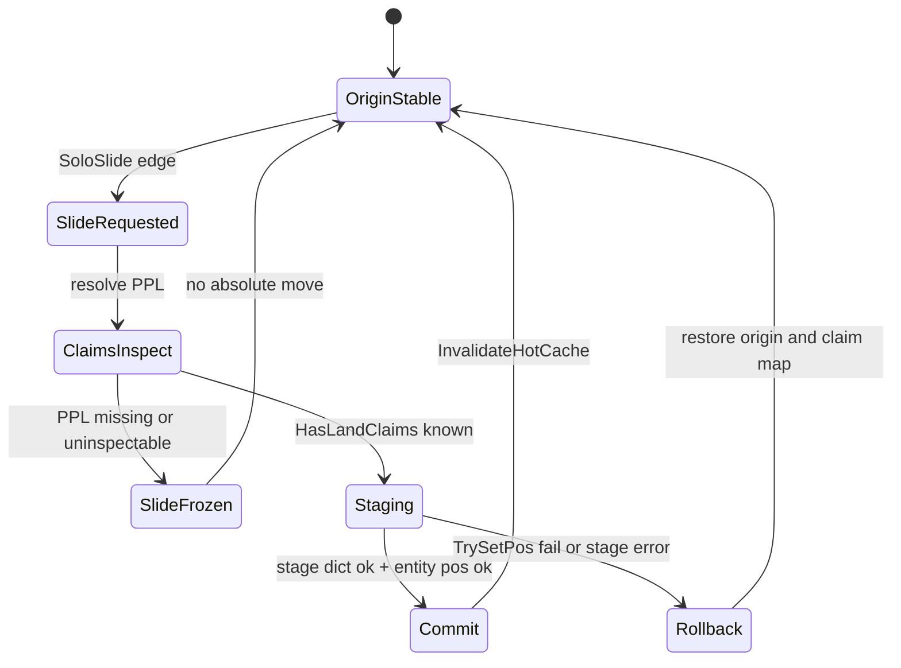

# RealEarth critical engine surfaces (V3.1.0)

**Owns:** managed engine surfaces the Streamed product depends on (product-facing RE).  
**Not:** product Done/Partial tables ([MODIFICATIONS](MODIFICATIONS.md)), Streamed architecture lessons ([realearth-runtime](realearth-runtime.md)), pure generic loop RE ([research INDEX](../../7dtd-research/docs/INDEX.md)).  
**Architecture lessons:** [`realearth-runtime.md`](realearth-runtime.md).  
**Adversarial catalog:** [`realearth-review.md`](realearth-review.md).  
**Generic engine hub:** [`../../7dtd-research/docs/INDEX.md`](../../7dtd-research/docs/INDEX.md) (loop, terrain-height, save-region without product policy).  
**Height overview:** [`../../7dtd-research/docs/terrain-height.md`](../../7dtd-research/docs/terrain-height.md).  
**Save deep-dive:** [`../../7dtd-research/docs/save-region.md`](../../7dtd-research/docs/save-region.md).  
**Dump:** [`../../7dtd-research/il/realearth-surfaces-v3.1.0/`](../../7dtd-research/il/realearth-surfaces-v3.1.0/).  
**Product hub:** [`INDEX.md`](INDEX.md).  
**Status:** [`MODIFICATIONS.md`](MODIFICATIONS.md) only.

**Pin note (2026-07-18):** live dedi stock `ChunkBlockYDim=256`. Expanded dump `terrain-v3.0.1` is historical (Steam Verify undoes expand).

## 0. What this document closes

Measured answers for Streamed product dependencies (all closed from dedicated IL):

| Question | Answer (IL-backed) |
|---|---|
| How does Chunk index blocks by Y? | `m_BlockLayers[y >> 2]` then in-layer offset with `y & 3` |
| Does GetBlock use WorldConstants masks? | Uses **shift-by-2** (layer height 4), not a load of `ChunkBlockYMask` in the hot path |
| Density indexing? | `ChunkBlockChannel` layer = `(y >> 2) * bytesPerVal`; offset via `calcOffset` |
| Heightmap storage type? | **`byte[] m_TerrainHeight`**, index `x + z*16` |
| World.GetTerrainHeight? | **byte**, via chunk sync + `Chunk.GetTerrainHeight` |
| World.GetHeightAt(float,float)? | **float** via `IChunkProvider.GetTerrainGenerator().GetTerrainHeightAt` |
| TerrainFromRaw height? | float from `HeightMap.GetAt`; byte path = `(GetAt+0.5) conv.u1` (**clamps to 0..255**) |
| Land claims owner map? | `PersistentPlayerList.m_lpBlockMap: Dictionary<Vector3i, PersistentPlayerData>` |
| PPL accessor? | `GameManager.GetPersistentPlayerList()` → field `persistentPlayers` (IL=3) |
| Stock origin shift? | `Origin` MonoBehaviour; auto distance² = **67600** (260 m); `DoReposition` fans out |
| Region / chunk files? | `RegionFileManager` + `RegionFileRaw` / `RegionFileSectorBased` / V1/V2; chunk ext **`.ttc`** |
| GenerateTerrain entry? | `ChunkProviderGenerateWorld.generateTerrain` → `ITerrainGenerator.GenerateTerrain` (11 IL trampoline) |

---

## 1. Chunk vertical storage model

### 1.1 Fields (measured)

| Field | Type | Role |
|---|---|---|
| `m_BlockLayers` | `ChunkBlockLayer[]` | Sparse vertical sections; length = `ChunkBlockLayers` (stock 64 = 256/4) |
| `chnDensity` | `ChunkBlockChannel` | Density volume |
| `chnLight` | `ChunkBlockChannel` | Light |
| `chnStability` | `ChunkBlockChannel` | Stability |
| `chnDamage` | `ChunkBlockChannel` | Damage |
| `chnTextures` | `ChunkBlockChannel[]` | Paint |
| `chnWater` | `ChunkBlockChannel` | Water |
| `m_TerrainHeight` | **`byte[]`** | 16×16 surface heightmap (lossy) |
| `m_HeightMap` | `byte[]` | Separate heightmap buffer |
| `m_Biomes` | `byte[]` | 16×16 biomes |
| `m_meshLayers` | `VoxelMeshLayer[]` | Mesh by Y bands |
| `CurrentSaveVersion` | uint **47** | Chunk binary format version |
| `SupportedSaveVersion` | uint **32** | Min readable |

### 1.2 Block index formula (from IL)

`Chunk.GetBlock(x, y, z)` (IL=100):



`ChunkBlockLayer.GetAt` (IL=16): layer holds 16×16×4 = **1024** slots; formula `x + (z<<4) + ((y&3)*256)`.

**Confirmed:** Y is split into **4-high layers**. Expanding `ChunkBlockLayers` from 64→4096 (with YDim 256→16384) is the correct binary expand strategy; **XZ remains 16**. Index math uses `y >> 2` and `y & 3`, not a hardcoded 255 ceiling in GetBlock.

**Fail mode if expand incomplete:** `m_BlockLayers[y >> 2]` OOB when y ≥ layer array length → catch path logs `GetBlock failed: _y = …, len = …` and rethrows.

### 1.3 Density index formula (from IL)

`Chunk.GetDensity(x,y,z)` → `chnDensity.Get(x,y,z)` → conv.i1.

`ChunkBlockChannel.Get` (IL=44):

```text
layerIndex = (y >> 2) * bytesPerVal
layer = layers[layerIndex]
if null → getSameValue(layerIndex)
else offset = calcOffset(x, y, z)
  // calcOffset (IL=12):
  //   return x + z*16 + (y & 3)*256
```

Same 4-high banding as blocks. Density values are **sbyte** at the Chunk API (`conv.i1` / `conv.u1` on set).

### 1.4 Terrain heightmap (byte, always)

```text
GetTerrainHeight(x,z):  m_TerrainHeight[x + z*16]   // byte
SetTerrainHeight(x,z,b): same index, stelem.i1
```

**Even with YDim=16384, chunk terrain heightmap cannot store heights > 255.** Product must:

1. Drive float `GetHeightAt` / generator height for tall surface.  
2. Write **blocks + density** for tall columns.  
3. Treat `GetTerrainHeight → byte` as lossy (min(255,h) or bypass).

---

## 2. World height APIs (Harmony targets)

### 2.1-2.2 Height queries



Harmony on the byte path only fixes **byte** callers. Float path uses `conv.i4` (truncate toward zero, not Floor).

### 2.3 Generator chain

| Type | Method | IL | Behavior |
|---|---|---:|---|
| `ChunkProviderGenerateWorld` | `generateTerrain(World,Chunk,GameRandom)` | **11** | Trampoline → `ITerrainGenerator.GenerateTerrain(..., Vector3i, Vector3i, bool, bool)` |
| `TerrainGeneratorWithBiomeResource` | `GetTerrainHeightAt` | **2** | Base returns **0f** always |
| `TerrainFromRaw` | `GetTerrainHeightAt` | **13** | `HeightMap.GetAt` after `checkCoordinates` |
| `TerrainFromRaw` | `GetTerrainHeightByteAt` | **16** | `(GetAt+0.5) conv.u1` → **byte clamp** |
| `TerrainFromRaw` | `GetDensityAt` | **19** | air vs terrain sbyte vs Y |
| `TerrainFromDTM` | (same family) | - | DTM path sibling |

`TerrainFromRaw.checkCoordinates`: shifts by `terrainWidthHalf` / `terrainHeightHalf` (map centered), rejects OOB → height 0 / density air.

**Product inject:** postfix **GenerateTerrain** on concrete generator + provider entry; also override height queries on `World` and concrete generators. Interfaces (`ITerrainGenerator`) cannot be patched directly.

---

## 3. Stock `Origin` (world origin shift)

7DTD already has a **Unity Origin shift** system independent of RealEarth SoloSlide.

### 3.1 Type

| Member | Value / role |
|---|---|
| base | `MonoBehaviour` |
| `cAutoRepositionDistanceSq` | **67600** = 260² meters |
| `Origin.position` | static current origin |
| `OriginChanged` | `Action<Vector3>` static event |
| `RepositionObjects` | list of transforms to move |
| `FixedUpdate` | IL=**256**; **calls `GameManager.get_IsDedicatedServer()`** |

### 3.2 FixedUpdate behavior (calls)

**Dedicated prologue (measured, dedi-complete dump):** pure dedicated is a permanent no-op state.



On **client / listen** only:

1. Game started / world / local players.  
2. `UpdateLocalPlayer` when local players exist (`cAutoRepositionDistanceSq` = 67600 ≈ 260 m).  
3. May call `Reposition(Vector3)`.  
4. Physics raycast down checks + warnings when floating.

### 3.3 `Reposition` → `DoReposition` (IL=186)

`Reposition` also forces a short Physics simulate pulse:

```text
DoReposition(delta)
Physics.simulationMode = …; Physics.Simulate(0.01); restore
```

`DoReposition` fan-out (measured calls):

| Target | Method |
|---|---|
| Shader | `SetGlobalVector` (origin uniform) |
| Registered transforms | `RepositionTransform` |
| Local player | `vp_FPController.Reposition` (client) |
| All entities | `Entity.OriginChanged(Vector3)` |
| Particles | `RepositionParticles` |
| Pathfinding | `AstarManager.OriginChanged` |
| Chunks | `ChunkManager.OriginChanged(Vector3)` |
| Deco | `DecoManager.OriginChanged` |
| Occlusion | `OcclusionManager.OriginChanged` |
| Audio | `Audio.Manager.OriginChanged` |
| Dynamic mesh | `DynamicMeshManager.OriginUpdate` |
| Subscribers | `OriginChanged` Action invoke |

### 3.4 Product consequence

RealEarth **SoloSlide** (session absolute recentering) is **not** the same as stock `Origin` shift:

| System | Moves | Why |
|---|---|---|
| Stock `Origin` | Unity transforms / floating origin for precision | Engine float precision at large coords |
| RealEarth SoloSlide | Session absolute Earth mapping + entity/claim remap | Keep Earth under a small local window |

They can **interact on listen/client**. Pure dedicated does not run Origin.FixedUpdate. On client/listen, if stock Origin repositions while RealEarth holds absolute session state, local coords and Earth mapping can desync unless product listens to `Origin.OriginChanged` or keeps local window small enough that stock Origin rarely fires. Product design residual (not unmapped managed RE): see [`residuals.md`](../../7dtd-research/docs/residuals.md) process residual + product SoloSlide notes.

---

## 4. Land claims / PersistentPlayerList

### 4.1 Storage

| Field | Type | Role |
|---|---|---|
| `Players` | `ObservableDictionary<…>` | Player records |
| `EntityToPlayerMap` / `PlayerToEntityMap` | dictionaries | entity ↔ player |
| **`m_lpBlockMap`** | **`Dictionary<Vector3i, PersistentPlayerData>`** | **land protection block → owner** |
| `Allies` | `AllyStore` | ally graph |

### 4.2 Key APIs

| Method | IL | Behavior |
|---|---:|---|
| `GetLandProtectionBlockOwner(Vector3i)` | 8 | `m_lpBlockMap.TryGetValue` |
| `PlaceLandProtectionBlock(Vector3i, userId)` | 47 | resolve player; steal from prior owner; `AddLandProtectionBlock`; `RemoveExtraLandClaims`; map update; **NavObject register**; `SavePersistentPlayerData` |
| `RemoveLandProtectionBlock` | - | inverse |
| `GetPlayerData` / `GetPlayerDataFromEntityID` | - | lookups |

### 4.3 GameManager accessor

```text
GameManager.GetPersistentPlayerList()  // IL=3
  → return this.persistentPlayers;
```

Field on `GameManager`: `public PersistentPlayerList persistentPlayers`.

**RE confirms product finding:** claims live on **GameManager**, not on `World` alone. Reflection that only walks World never finds PPL.

### 4.4 Slide remap implications

- Keys are **`Vector3i` world block positions** (engine-local).  
- SoloSlide must remap every key by origin delta.  
- Stage-commit (product fix) matches dict mutability: partial rewrite corrupts ownership.  
- Place path also registers **NavObject** and saves; remapping claims may need nav object refresh (product residual).



---

## 5. Region / chunk persistence surface

### 5.0 Chunk binary write/read (CRITICAL for expand)

Measured stock IL (`Chunk.write` IL=601, `Chunk.read` IL=775):

**Layer loop is hardcoded to 64, not `WorldConstants.ChunkBlockLayers`:**

```text
// write (IL_0075..IL_0079):
for (i = 0; i < 64; i++) {          // ldc.i4.s 64
  present = m_BlockLayers[i] != null;
  Write(present);
  if (present) m_BlockLayers[i].Write(...);
}

// read (IL_00BA..IL_00BD): same bound
for (i = 0; i < 64; i++) {
  if (ReadBoolean()) {
    layer = pool.Alloc();
    layer.Read(...);
    m_BlockLayers[i] = layer;
  }
}
```

| Implication | Detail |
|---|---|
| Expand fields alone is **insufficient** | YDim/Layers constants can be 16384/4096 while save still only persists **64** layers (Y 0..255) |
| Tall inject lost on unload/reload | Blocks in layers ≥64 vanish on save under stock write IL |
| Patcher must rewrite these sites | Binary expand tools need to retarget `ldc.i4.s 64` in write/read (and any sibling loops) to expanded layer count |
| Heightmap arrays stay 256 bytes | `m_HeightMap` / biomes clear/read use **ldc.i4 256** (16×16); correct; do not expand XZ |

Also: `World.toBlockY(int)` is **`y & 255`** (IL=4). Any path using `toBlockY` clamps to stock vertical range. Expand must patch this to `YMask` or expanded mask.

Entry wrappers:

| Method | IL | Role |
|---|---:|---|
| `save(PooledBinaryWriter)` | 14 | → `write` |
| `load(PooledBinaryReader, uint)` | 9 | → `read` |
| `write` / `read` overloads | small | flag defaults |
| `OnLoad` / `OnUnload` | 97 / 188 | post-load entity/TE |

Dump detail: `SAVE_LIGHT_auto.md` in the surfaces dump dir.

### 5.1 Type hierarchy (measured)

```text
RegionFile (path helpers, regionX/Z)
  ├─ RegionFileRaw          (21 methods) , modern raw layout
  └─ RegionFileSectorBased
       ├─ RegionFileV1
       └─ RegionFileV2

RegionFileAccessAbstract
  └─ RegionFileAccessMultipleChunks
       ├─ RegionFileAccessRaw
       └─ RegionFileAccessSectorBased

RegionFileManager : WorldChunkCache   (73 methods), runtime cache + cull + protect
RegionFileChunkSnapshot / Reader / Writer
Factories: RegionFileFactoryRaw, RegionFileFactorySectorBased
```

### 5.1b RegionFileRaw layout constants (measured)

| Constant | Value | Meaning |
|---|---|---|
| `CurrentVersion` | 1 | Raw format version |
| `FileHeaderMagicBytesLength` | 3 | Magic prefix |
| `ChunksPerRegionPerDimension` | **8** | 8×8 chunks per region file |
| `ChunksPerRegion` | **64** | 8² |
| `fileHeaderLength` | 11 | |
| `locationHeaderLength` | 128 | |
| `timestampHeaderLength` | 64 | |
| `sectorsStartOffset` | 779 | payload start |
| `reservedBytesPerEntry` | 4 | |

`GetOffsetFromXz`: `localX = x % 8`, `localZ = z % 8` (negative adjust +7), index = `localX + localZ*8`.

Sector-based sibling uses **% 32** per dimension (different packing).

### 5.2 RegionFileManager constants (ops-relevant)

| Constant | Value | Meaning |
|---|---|---|
| `cChunkFileExt` | **`.ttc`** | Chunk file extension in region system |
| `pendingResetsFileName` | `PendingResets.7pr` | Reset queue file |
| `cMaxChunksToCull` | 10000 | Cull batch cap |
| `cMinimumByteAllowance` | 20971520 (20 MiB) | Cache budget floor |
| `cHeadroomBytes` | 5242880 (5 MiB) | Headroom |
| `cProtectedLandClaimChunkMargin` | 1 | Claim protection margin (chunks) |
| similar margins | 1 | bedroll, offline player, backpack, vehicle, quest, supply crate |

**Note:** community docs often say `.7rg` for region containers. This assembly’s `RegionFileManager` literal for chunk payloads is **`.ttc`**. Managed type map + header constants are **closed** (this section + [`save-region.md`](../../7dtd-research/docs/save-region.md)). Optional hand-annotation of every compressed sector payload byte is listed under [`residuals.md`](../../7dtd-research/docs/residuals.md) (not required for dedi sim loop understanding).

### 5.3 Chunk save version

- `Chunk.CurrentSaveVersion = 47`  
- `Chunk.SupportedSaveVersion = 32`  
- read rejects `_version < 32` with exception string `Chunk version N not supported!`

**CLOSED:** layer count source is **hardcoded 64** in write/read (§5.0), not array length and not a field load of `ChunkBlockLayers`.

### 5.4 WorldState (**CLOSED**)

Present on `World.worldState`. Managed save path **closed** in [`save-region.md`](../../7dtd-research/docs/save-region.md):

| Method | IL | Evidence |
|---|---:|---|
| `WorldState.SaveLoad(Stream,…)` | **884** | `loop-complete` + `dedi-complete` dumps; ~59× `ReadWrite`, field set listed |
| `WorldState.SetFrom(World, providerId)` | 164 | sleeper/trigger/wall volumes, AIDirector.Save, spawner stream |
| `World.SaveWorldState` | 16 | SetFrom → Save to GameIO dir |

No longer an open managed gap.

---

## 6. Prefab placement (**CLOSED** managed entry)

| Type | Role |
|---|---|
| `WorldGenerationEngineFinal.PrefabManager` | RWG-time prefab selection (districts, wilderness) |
| `Prefab` | Instance data + **`CopyIntoLocal(ChunkCluster, Vector3i, …)` IL=680** (dumped `realearth-surfaces`) |
| `PrefabInstance` | Placed instance bookkeeping |
| `DynamicPrefabDecorator` | Runtime decoration |

Managed surface is inventoried (method IL + call files under dump set). Product POI stamps should call into the same **CopyIntoLocal / cluster SetBlock** family. Signature variance after TFP patches is a **post-patch IL drift** residual ([`residuals.md`](../../7dtd-research/docs/residuals.md)), not an unmapped type.

---

## 7. Light / stability / mesh (inject fallout)

| Type | Role for tall inject |
|---|---|
| `ChunkCluster.LightChunk` | Relight after column rewrite |
| `ChunkCluster.CalcStability` | Stability pass |
| `ChunkCluster.RegenerateChunk` | Mesh regen |
| `StabilityCalculator` / `StabilityInitializer` | Workers |
| `LightingAround` / `LightProcessor` / `ILightProcessor` | Light pipeline |
| `MeshGeneratorMC2` | MC mesher; has int `GetTerrainHeight` |
| `MeshDataManager` | LateUpdate batch mesh apply |
| `DynamicMeshManager` | Peer Update; `OriginUpdate` on origin shift |

### 7.1 Hardcoded 255/256 in light and height paths (stock scan)

Methods that load **255** or **256** near light/height (non-exhaustive; dump § SAVE_LIGHT):

| Method | Lit | Risk if YDim expanded without patch |
|---|---|---|
| `Chunk.RefreshSunlight` | **255** | Sun column loop starts at y=255 downward only |
| `Chunk.RecalcHeights` | 255 | Height rebuild capped |
| `Chunk.ResetStability` / `ResetStabilityToBottomMost` | 256 | Stability span stock-sized |
| `LightProcessor.RefreshSunlightAtLocalPos` | 255 | Local sun refresh |
| `LightProcessor.RefreshLightAtLocalPos` | 255 | |
| `LightProcessor.SpreadLight` / `UnspreadLight` | 255/256 | Propagation bounds |
| `MeshGeneratorMC2.calcLights` / `CreateMesh` / `mc2LayerIsEmpty` | 255 | Mesh light sampling |
| `MeshGeneratorPrefab.calcLights` | 255 | |
| `World.toBlockY` | **255** (`and`) | **Masks Y to 0..255 always** |
| `ChunkCluster.chunkPosNeedsRegeneration` | 255 | Regen range |

`Chunk.RefreshSunlight` pattern: for each x,z start `y=255` and walk down setting light. **Above y=255 never gets sunlight under stock IL.**

**Managed RE:** site inventory **closed** (this section + [`light-mesh-water.md`](../../7dtd-research/docs/light-mesh-water.md)). Product expand patcher must retarget these Y ceilings; live soak under expand is a **product** bar, not an unmapped engine surface.

---

## 8. Nav / map objects (city labels)

| Type | Role |
|---|---|
| `NavObjectManager` | Register/unregister nav objects (claims also use this) |
| `NavObject` | Map pin instance |
| `MapObjectManager` / `MapObject` | World map objects |

City discover-on-approach product path should use stock nav/map registration rather than drawing outside the FOW/map systems. Claim place already shows the register pattern.

---

## 9. Generate / load pipeline (Streamed inject hook)

```text
ChunkProviderGenerateWorld.generateTerrain(World, Chunk, GameRandom)
  └─ ITerrainGenerator.GenerateTerrain(World, Chunk, GameRandom,
         Vector3i min, Vector3i max, bool, bool)

ChunkCluster.AddChunkSync / LightChunk / CalcStability / RegenerateChunk
RegionFileManager cache + protect + cull
World.OnUpdateTick / ChunkManager (see loop)
```

**Harmony strategy (validated by RE):**

1. Postfix concrete `GenerateTerrain` (and/or provider trampoline).  
2. Prefetch tiles on chunk index hooks (do not double-inject).  
3. Override height queries on concrete types.  
4. Fail-closed when tiles missing.

---

## 10. Expand state discipline

| Dump | `ChunkBlockYDim` | When |
|---|---:|---|
| `terrain-stock-v3.0.1` | 256 | Stock backup |
| `terrain-v3.0.1` | 16384 | Expanded (2026-07-16) |
| `realearth-surfaces-v3.0.1` (live dedi) | **256** | **2026-07-18 stock again** |

**Ops lesson:** Steam Verify / updates restore stock. Product `ExpandProductGuard` and `engine-audit` must refuse 1:1 claims on stock YDim. Re-expand client + dedicated after every update.

Indexing math (`y >> 2`) is expand-friendly **if** `m_BlockLayers.Length` matches `ChunkBlockLayers` after patch.

---

## 11. Managed status + residuals (aligned with residuals.md)

### 11.1 Managed surfaces in this doc (**CLOSED**)

| Surface | Closure |
|---|---|
| Chunk GetBlock / density index | §1 (`y >> 2`, layer height 4) |
| Chunk write/read layer bound | §5.0 **hardcoded 64** |
| ChunkBlockChannel Read/Write | **CLOSED:** Read IL=151, Write IL=120 (lits include 1024); `dedi-complete` §12 |
| World / Terrain height APIs | §2 |
| WorldState.SaveLoad field set + call graph | §5.4 + [`save-region.md`](../../7dtd-research/docs/save-region.md) (IL=884) |
| Origin.FixedUpdate on dedicated | §3.2 **no-op** (`IsDedicatedServer` → ret) |
| Origin DoReposition fan-out | §3.3 (client/listen) |
| Land claims / PPL | §4 |
| Region type map + RegionFileRaw constants | §5.1-5.1b |
| Prefab.CopyIntoLocal entry | §6 IL=680 dump present |
| Light/stability 255 site inventory | §7.1 |
| GenerateTerrain trampoline | §9 |

### 11.2 Non-IL / process residuals only

See canonical list: [`residuals.md`](../../7dtd-research/docs/residuals.md). Items that used to live here as “open RE”:

| Item | Classification |
|---|---|
| Region sector payload hand-annotation | Residual: optional deep layout; methods dumped |
| Stock Origin vs RealEarth SoloSlide product policy | Product design (not unmapped managed types) |
| Expand patcher regression after TFP update | Process residual (post-patch IL drift) |
| Client vs dedicated expand ops checklist | Ops / product (constants measured both ways in terrain dumps) |
| Live inject soak under expand | Product verification bar |

---

## 12. Regeneration

```bash
DS="${SEVENDTD_DS_DIR:-$HOME/.local/share/Steam/steamapps/common/7 Days to Die Dedicated Server}"
ASM="$DS/7DaysToDieServer_Data/Managed/Assembly-CSharp.dll"
cd 7dtd-optimizer/tools
mcs -r:Mono.Cecil.dll -out:DumpRealEarthSurfaces.exe DumpRealEarthSurfaces.cs
mono DumpRealEarthSurfaces.exe "$ASM" ../../7dtd-research/il/realearth-surfaces-v3.1.0
# also: DumpTerrain.exe for WorldConstants-focused set
```

After expand re-apply, regenerate **both** `terrain-*` and `realearth-surfaces-*` and re-check §10.

---

## Changelog
- **2026-08-10:** Body IL citations re-verified against the V3.1.0 dump:
  `ChunkBlockChannel.Get` IL=44, `World.GetHeightAt` IL=22,
  `GetTerrainHeight` IL=19, `GetPersistentPlayerList` IL=3,
  `ChunkBlockLayer.GetAt` IL=16 - all current (the pending re-verification flag below is resolved).
- **2026-08-09:** Retarget V3.0.1 -> V3.1.0 (Henpocalypse). Mod + engine patcher verified against V3.1.0 b14 client and dedicated DLLs; body IL citations below are V3.0.1-era and pending re-verification against the V3.1.0 dump (see research `terrain-height.md` / `save-region.md` for current numbers).  
- **2026-07-18:** §11 reconciled with RESIDUALS; WorldState/Origin/density channel/Prefab marked Closed; dedicated Origin no-op corrected.  
- **2026-07-18:** Chunk write/read hardcoded 64 layers; World.toBlockY `y&255`; light/sun 255 scan; RegionFileRaw 8×8 layout; Entity/ChunkManager OriginChanged bodies.  
- **2026-07-18:** Initial surfaces RE: chunk index math, height APIs, PPL/claims, Origin fan-out, region type map, expand state note, dump tool + 400+ raw files.

---

# Origin and land claims (detail)

Expanded Origin/PPL notes (formerly realearth-surfaces). Summary also in §3-4 above.

## 1. Two different “origin” concepts

| Concept | Owner | Coordinate space | Purpose |
|---|---|---|---|
| **Stock `Origin`** | TFP `Origin` MB | Unity world transforms | Floating origin for float precision |
| **RealEarth session origin** | `WorldSession` | Absolute Earth ↔ engine-local map | Stream planet under finite host |
| **Chunk indices** | `Chunk.m_X/m_Z` | Chunk grid | Load/unload, region keys |

Confusing them causes wrong remaps, double-shifts, or claim corruption.

---

## 2. Stock Origin pipeline

```text
Origin.FixedUpdate (IL=256)
  ├─ if IsDedicatedServer → ret   // pure dedicated: NO-OP
  ├─ (client/listen only below)
  ├─ GameStateManager.IsGameStarted
  ├─ World.GetLocalPlayers
  ├─ UpdateLocalPlayer(EntityPlayerLocal)
  └─ Reposition(Vector3) when threshold / manual flags

Origin.Reposition
  ├─ DoReposition(Vector3)   // IL=186 fan-out
  └─ Physics.Simulate(0.01) pulse

DoReposition fan-out:
  Shader global origin vector
  RepositionObjects transforms
  vp_FPController.Reposition (local player client)
  foreach Entity → Entity.OriginChanged
  particles, AstarManager, ChunkManager,
  DecoManager, OcclusionManager, Audio.Manager,
  DynamicMeshManager.OriginUpdate
  OriginChanged Action<Vector3>
```

### Constants

| Name | Value | Interpretation |
|---|---|---|
| `cAutoRepositionDistanceSq` | **67600** | Distance² threshold ≈ **260** blocks from origin before auto shift |

### Product hooks

| Option | Use |
|---|---|
| Subscribe `Origin.OriginChanged` | Keep RealEarth session math consistent if stock shifts |
| Keep `LocalWindowSize` small | Reduce chance stock auto-origin fires |
| Pure dedicated skips Origin.FixedUpdate | Early `ret` when `IsDedicatedServer`; DoReposition still relevant on listen/client |

---

## 3. Land protection data model

```text
GameManager.persistentPlayers : PersistentPlayerList
GameManager.GetPersistentPlayerList() → same field (IL=3)

PersistentPlayerList
  m_lpBlockMap : Dictionary<Vector3i, PersistentPlayerData>
  Players, EntityToPlayerMap, PlayerToEntityMap, Allies

PlaceLandProtectionBlock(pos, userId):
  data = GetPlayerData(userId)
  if m_lpBlockMap has prior owner → prior.RemoveLandProtectionBlock(pos)
  data.AddLandProtectionBlock(pos)
  RemoveExtraLandClaims(data)   // enforce claim count limits
  m_lpBlockMap[pos] = data
  NavObjectManager.RegisterNavObject(...)
  SavePersistentPlayerData()
```

### Keys are engine-local blocks

`Vector3i` claim positions are **not** lon/lat and **not** absolute Earth until product maps them. After SoloSlide by `(dx,dz)`:

```text
newKey = oldKey + (dx, 0, dz)   // Y unchanged for land claim blocks typically
```

### Fail-closed rules (product + RE)

| Situation | Safe behavior |
|---|---|
| PPL null / uninspectable | Do not slide (freeze SoloSlide) |
| Partial dict rewrite fails | Restore previous map (stage-commit) |
| NavObject left at old pos | Residual: refresh or unregister/register |

---

## 4. Entity positions on stock Origin vs SoloSlide

| Event | Entity API seen in stock path |
|---|---|
| Stock origin shift | `Entity.OriginChanged(Vector3)` from `DoReposition` |
| RealEarth SoloSlide | Product reflection SetPos / position field + claim remap |

### 4.1 `Entity.OriginChanged(Vector3)` (IL=21): CLOSED

```text
physicsPos += delta
physicsTargetPos += delta
if emodel: emodel.OriginChanged(delta)
```

Does **not** rewrite claim maps, tile entities, or session absolute coords. Physics/model only.

### 4.2 `ChunkManager.OriginChanged(Vector3)` (IL=29): CLOSED

```text
foreach ChunkGameObject in m_UsedChunkGameObjects:
  transform.position += delta
```

Mesh/GO visual positions only; chunk **indices** (`m_X/m_Z`) unchanged.

---

## 5. Region manager claim protection

`RegionFileManager` protects chunks near claims from cull:

- `cProtectedLandClaimChunkMargin = 1`  
- Similar margins for bedroll, offline player, backpack, vehicle, quest, supply crate  

Sliding claims without updating protection maps can allow premature chunk cull or over-protect stale areas.

---

## 6. Managed status

| Item | Status |
|---|---|
| Origin.FixedUpdate on pure dedicated | **CLOSED** no-op (`IsDedicatedServer` → ret) |
| DoReposition fan-out | **CLOSED** §2 (client/listen) |
| Entity.OriginChanged | **CLOSED** §4.1 (physicsPos + emodel) |
| ChunkManager.OriginChanged | **CLOSED** §4.2 (GO transforms only) |
| PPL / m_lpBlockMap / PlaceLandProtectionBlock | **CLOSED** §3 |
| GetPersistentPlayerList | **CLOSED** GM field IL=3 |

Product SoloSlide ↔ claim/nav refresh is product residual, not unmapped managed RE. Canonical residuals: [`residuals.md`](../../7dtd-research/docs/residuals.md).

## Changelog (merged source 2)
- **2026-07-18:** §6 closed managed list; removed false “dedicated Origin still open” items.  
- **2026-07-18:** Initial Origin + claims RE from realearth-surfaces dump.
